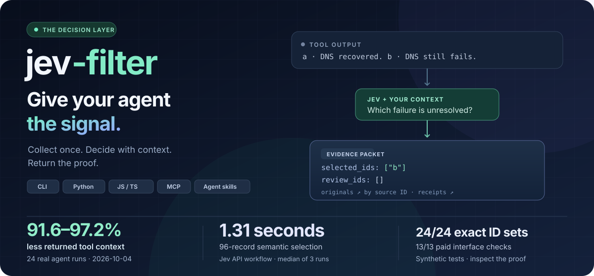
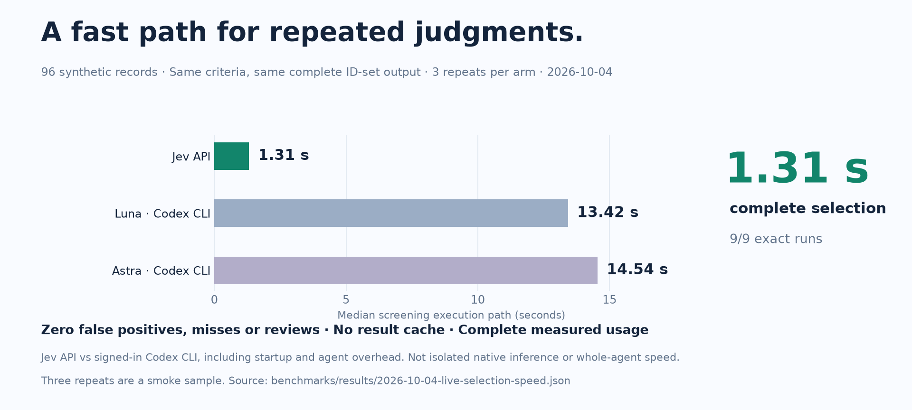
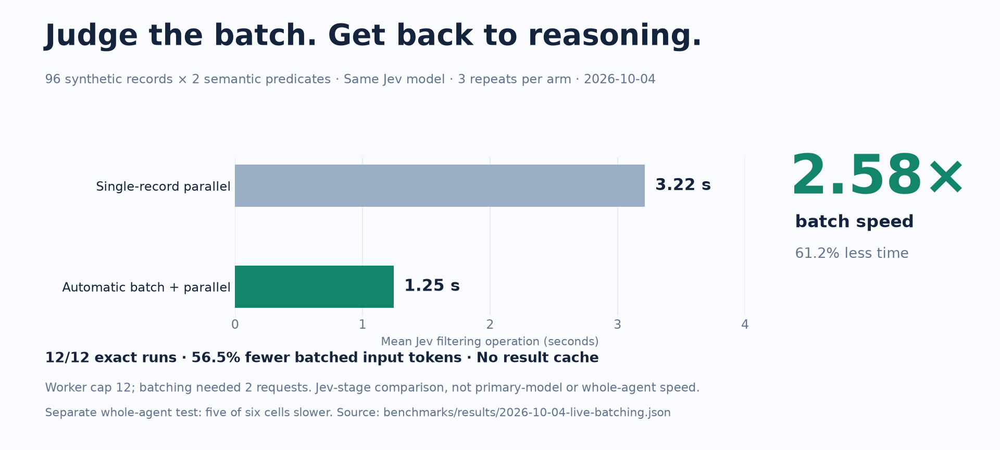
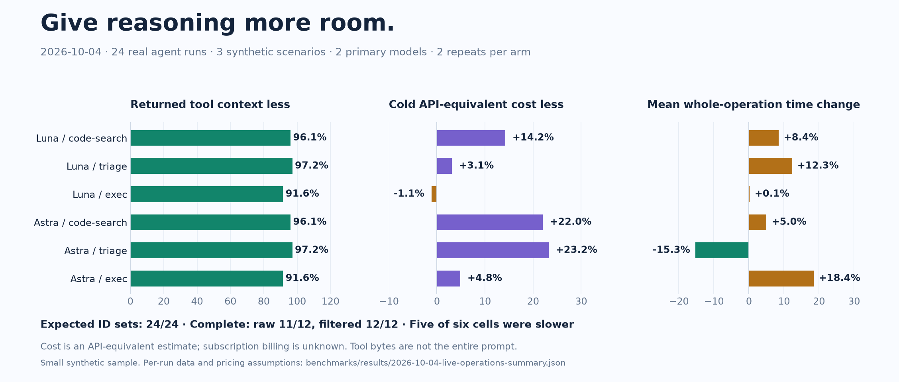
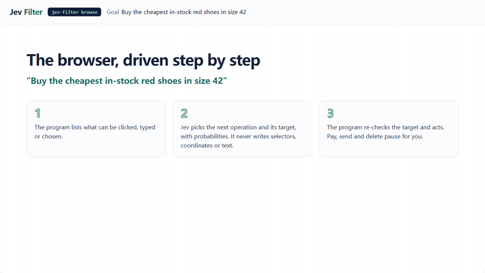

<p align="center">
  
</p>

<p align="center">
  <a href="https://github.com/apixly-ai/jev-filter/actions/workflows/ci.yml"></a>
  <a href="https://github.com/apixly-ai/jev-filter/releases"></a>
  <a href="https://www.npmjs.com/package/@apixly/jev-filter"></a>
  <a href="LICENSE"></a>
</p>
<p align="center">
  <a href="README.zh-CN.md">简体中文</a> · <a href="#quick-start">Quick start</a> · <a href="https://apixly-ai.github.io/jev-filter/">Documentation</a> · <a href="docs/agent-quickstart.md">Agent setup</a> · <a href="docs/benchmarks.md">Benchmarks</a> · <a href="https://github.com/apixly-ai/jev-filter/releases">Releases</a>
</p>

# Jev Filter: semantic filtering for AI agent tools

**Give your agent the signal. Keep the evidence.** Jev Filter turns large tool outputs into compact, typed decisions before they enter your agent's context. Commands, code, logs and page records stay inside the program; your agent receives relevant evidence and the IDs that need its attention.

**Semantic filtering for retrieved evidence and agent tool results.** Maintained by Apixly as an independent MIT project, the official package is **`@apixly/jev-filter`**. Use it after a search or collector produces candidates: screen them against your task and supplied facts, keep unresolved cases visible, and recover originals by ID. [What it does and when to use it](docs/faq.md).

**96 records screened in 1.31 seconds. The same exact result.** Paid same-output A/B: Jev's batched API path took a median **1.313 s**, versus **13.421 s** for Luna and **14.543 s** for Astra through signed-in Codex CLI. All **9/9** runs selected the same correct 48 IDs. Three repetitions per path on synthetic inputs; CLI startup is included, and no primary-agent continuation follows Jev. [Compare the measured paths →](#measured-advantages)

**91.6–97.2% less returned tool context. 24/24 exact ID sets.** A separate whole-agent A/B on **2026-10-04** measured three synthetic scenarios, two primary models and two repetitions per arm. Every original remains recoverable by ID. [Live evidence and trade-offs →](#measured-advantages)

## More signal. Less work for your agent.

| **Focus the agent** | **Make every decision traceable** | **Let the program finish the job** |
|---|---|---|
| Filter large batches against the task and supplied context. The primary model spends its attention on the selected evidence and difficult cases. | Typed answers, source IDs, local originals and receipts. Missing facts, uncertain choices and partial failures stay visible. | For short browser and desktop goals, Jev chooses from observed controls; the program owns execution, safety gates and final-state verification. |

The result is a useful division of labor: **programs collect and verify; Jev makes repeated semantic judgments; your agent plans, reasons and writes.** Automatic batching reduces repeated input, up to 30 requests run concurrently, and no result cache hides a new observation.

## Proven where your agent actually works

**Do the repeated judgments together.** The program shares task context across each bounded batch: a separate batching A/B used **2 requests instead of 96**, with **56.5% fewer Jev input tokens** and **2.58× filtering speed** compared with single-record parallel Jev calls. You get the same labeled result in less waiting time, without a result cache.

**Put the signal in the conversation, keep the full trace within reach.** In the fresh whole-operation A/B, the filtered agent completed **12/12** runs; raw context completed **11/12**. All 24 runs returned the expected ID sets. This measures collection, real primary-agent tool use and continuation together.

**Find more of the behavior you meant.** Opt-in code recall plus native Jev filtering recovered **10/12** labeled matches, versus **4/12** for exact candidates, with zero false positives. Bounded diff triage selected all four target changes in both repetitions. Originals and source freshness remain independently checkable.

**Use the route you already have.** **13/13 paid interface checks** passed across the Python CLI, a fresh published npm install, JavaScript, official MCP, local page extraction and survey. You get the same evidence contract without rebuilding your agent.

The context gain is the strongest result. **Five of six whole-operation cells were slower; a cheap-model `exec` cell cost 1.1% more in the cold API-equivalent estimate.** Smaller context does not guarantee lower latency or billing. [Numbers, methods and negative results →](docs/benchmarks.md)

[Agent integration examples →](docs/agent-quickstart.md#javascript-and-mcp) · [Command reference →](docs/cli.md)

## Quick start

**Node.js 22+ · macOS / Linux · Python included in the npm distribution.** Windows: use WSL or [install Python natively](docs/getting-started.md#python-library-source-install). Installation and `doctor` are offline; inference needs a TypeSafe Jev API key.

```sh
npm install -g @apixly/jev-filter
jev-filter doctor
```

Run this from any directory:

```sh
export TYPESAFE_API_KEY='your-key'

jev-filter query --input - --mode choose \
  --task 'Choose the CURRENT unresolved DNS failure' <<'JSON'
[
  {"id":"a","text":"DNS recovered; requests now succeed."},
  {"id":"b","text":"DNS lookup still fails before connection."}
]
JSON
```

Expected selection, with diagnostics omitted:

```json
{"selected_ids":["b"],"review_ids":[],"complete":true}
```

For real batches, collect and filter in **one call**, before raw output reaches the conversation:

```sh
jev-filter exec --task 'Find unresolved network failures' \
  --analysis analysis.json -- your-collector --json
```

Start with the [copyable analysis contract](docs/recipes.md#1-custom-command-output). Parse the packet even on exit **2**: `complete=false` and `review_ids` need attention. Small examples teach the interface; exact paths, IDs, selectors, calculations and short outputs usually belong in native tools. [Installation, keys and result handling →](docs/getting-started.md)

## Practical tutorials

- [Filter search results for RAG and AI agents](docs/search-result-filtering.md): select passages against explicit evidence requirements before they enter the main model's context.
- [Search code by behavior](docs/semantic-code-search.md): combine complete code symbols, optional bounded recall and semantic judgment.
- [Triage correlated logs](docs/log-triage.md): preserve request history and separate current failures from recovered events.

Copyable synthetic inputs and analysis contracts are included. [Read the tutorials on the documentation site](https://apixly-ai.github.io/jev-filter/) · [FAQ](docs/faq.md).

## Measured advantages

Fresh **paid live evidence · 2026-10-04**. Inputs, source hashes, per-run tokens, complete timing and failures are public. Each result belongs to its stated scope.

**Fast semantic selection, checked against the same expected answer.** All paths screened 96 records against two semantic conditions and returned exactly the same 48 matching IDs.

| Measured path | Median screening time | Exact complete runs |
|---|---:|---:|
| **Jev `jev-1.13.0` · auto-batched API** | **1.313 s** | **3/3** |
| Luna `gpt-5.6-luna` · signed-in Codex CLI | 13.421 s | 3/3 |
| Astra `gpt-6-astra` · signed-in Codex CLI | 14.543 s | 3/3 |

This compares available **execution paths**, including CLI startup and the primary-agent turn; native model latency is not isolated. Primary paths use medium reasoning and no tools. Three repetitions are a smoke sample, not a whole-agent speedup or workload guarantee. [Per-run evidence](benchmarks/results/2026-10-04-live-selection-speed.json) · [Method and reproduction](docs/benchmarks.md#same-output-screening-fast-selection-through-the-measured-paths)



| Advantage | Observed result | Scope and trade-off |
|---|---|---|
| **Get repeated judgments sooner** | **2.58× filtering speed**: **3.215 → 1.246 s**, **61.2% less elapsed time**; **56.5% fewer Jev input tokens**. | Single-record parallel vs automatic batch-parallel Jev, 96 synthetic records × two predicates, three repetitions per arm; all **12/12** runs exact. Jev stage only, parallel worker cap 12; not a primary-model speed comparison. [Data](benchmarks/results/2026-10-04-live-batching.json) |
| **Keep the agent's context focused** | **91.6–97.2% less returned tool context**; filtered completion **12/12**, raw **11/12**; all **24/24 ID sets correct**. | 24 real agent runs, three synthetic scenarios, two primary models, two repetitions per arm. Five/six cells slower by **0.1–18.4%**; cold API-equivalent cost ranged from **23.2% lower to 1.1% higher**. Subscription billing remains unknown. [Data](benchmarks/results/2026-10-04-live-operations-summary.json) |
| **Recover more relevant code** | Correct matches **4/12 → 10/12**, **zero false positives**. | Exact vs opt-in recall, both with native semantic filtering. Returned context grew **5,284 → 9,706 bytes**; absent lexical overlap still misses. [Data](benchmarks/results/2026-10-04-live-records.json) |
| **Inspect the change that matters** | All **4/4** target changes selected in each repetition; returned context **23.9% lower** than retaining every file. | Eight synthetic files, two repetitions. Semantic triage adds model usage and increases median whole-operation time **503 → 1,465 ms**. [Data](benchmarks/results/2026-10-04-live-records.json) |
| **Connect real interfaces** | **13/13 paid E2E checks pass**, including exact MCP evidence recovery and **64/64** survey topic labels. | Python CLI, fresh npm **0.4.0** JS/native package, official MCP, local Chromium extraction and survey. Small synthetic fixtures; resolved model identity is unavailable from these public adapters. [Data](benchmarks/results/2026-10-04-live-interfaces.json) |
| **Reach inside a scroll container** | Verified nested-scroll completion **0/3 → 3/3** under the same strict **0.55 / 0.10** policy. | Pinned browser source A/B; program adds observed container evidence. Six ordinary goal runs still need review. More successful work consumes more calls, context and time. [Data](benchmarks/results/2026-10-04-live-browser-final-ab.json) |



<details>
<summary><strong>See the new whole-operation chart and reproduce the results</strong></summary>



[Method and all live results](docs/benchmarks.md) · [Per-run JSON](benchmarks/results/2026-10-04-live-operations.json) · [CSV](benchmarks/results/2026-10-04-live-operations.csv) · [Reproducible driver](benchmarks/operations.py)

</details>

<details>
<summary><strong>Earlier evidence: offline contracts, batching and open-web limitations</strong></summary>

| Experiment | Dated result | Scope |
|---|---|---|
| Offline release contracts · 2026-10-04 | **3/13 → 13/13** expected behaviors; **3 → 0** false fixture actions. | Scripted responses, no model calls; reviews and diagnostic context increase. [Data](benchmarks/results/2026-10-04-decisions.json) |
| Jev batching · 2026-09-22 | **56.5% fewer input tokens**; batch + parallel **32.4% faster** than single-record parallel. | 96 synthetic records × two predicates, two repetitions; Jev stage only. [Data](benchmarks/results/2026-09-22-live.json) |
| Historical whole operation · 2026-09-23 | **88–97% less returned tool context**. | 48 runs over four synthetic scenarios; cost and latency vary. [Data](benchmarks/results/2026-09-23-operations.json) |
| Historical hosted fixtures · 2026-09-30 | Browser **15/15 Camofox**, **18/18 CDP**; desktop **12/12**. | Local fixtures under the then-current planner policy; not a current strict-policy or open-web completion guarantee. [Data](benchmarks/results/2026-09-30-hosted.json) |
| Public websites · 2026-09-30 | **16/48** read-only goals reached; **16/34** after excluding access walls and provider failures. | 24 goals in one environment. Custom widgets and verification were weak. [Data](benchmarks/results/2026-09-30-real-world.json) |

[Full methods and historical data](docs/benchmarks.md). The latest browser experiments retain failed pruning variants and unknown provider attempts; they do not turn a safe stop into a completed goal.

</details>

## Watch the program turn a goal into a verified result

<p align="center">
  <a href="https://apixly-ai.github.io/jev-filter/docs/assets/showcase/index.html"></a>
</p>

Each step observes the page or window, lets Jev choose from program-enumerated operations and controls, rechecks the target, executes and verifies. Model output never becomes a selector, coordinate, command or unvetted text. Irreversible actions pause for confirmation.

```sh
jev-filter browse --url https://shop.example/ \
  --goal 'Find in-stock red shoes in size 42' \
  --value query='red shoes' --verify-text 'Search results'
```

Replace the example URL with your permitted test page and meaningful verifier. For `browse` and `desktop`, require **`status: done` and an independent final-state check**; `extract` and `survey` require `ok` and `complete`. A selected action or model-reported `DONE` alone is not proof of completion. A separate [verified primary-planner reference](docs/benchmarks.md) reached **6/6** expected outcomes after strict review; it adds substantial model time and is not an automatic fallback shipped in the product.

[Interactive replay: browser, desktop, survey](https://apixly-ai.github.io/jev-filter/docs/assets/showcase/index.html) · [Recording method](docs/showcase.md) · [Safety gates and limitations](docs/hosted-execution.md)

## One core, your existing agent

**CLI · Python · JavaScript / TypeScript · MCP.** Use the shell, embed `jev_filter.batch.run`, import `createClient` from `@apixly/jev-filter`, or expose four read-only MCP tools. Each route keeps evidence and partial results in the same core. [JavaScript and MCP examples →](docs/agent-quickstart.md#javascript-and-mcp)

Install the supplied skill for Codex, Claude Code or another compatible harness:

```sh
# Codex; use ~/.claude/skills for Claude Code.
mkdir -p ~/.codex/skills
cp -R "$(npm root -g)/@apixly/jev-filter/skills/jev-filter" ~/.codex/skills/
```

Give the agent one routing rule:

```text
Use jev-filter for many records that need a clear semantic judgment.
Pass the task, scope, exclusions, success criteria and sourced facts.
Keep collection → analysis → compact output inside one tool call.
Inspect unresolved IDs; use native tools for exact or short work.
Do not repeat settled judgments or wrap an existing Jev workflow again.
```

Jev does not inherit the agent's chat. Put shared facts in `context`, history on each record, and declare required fields. Keep authorization and execution verification in your host program. [Five-minute setup →](docs/agent-quickstart.md) · [Full integration guide →](docs/agents.md)

<details>
<summary><strong>Find the right entrypoint for your task</strong></summary>

| Task | Command / API | Guide |
|---|---|---|
| Capture a trusted command's output | `exec` | [Collector recipe](docs/recipes.md#1-custom-command-output) |
| Select or classify JSON candidates | `query` | [Context-aware selection](docs/recipes.md#2-select-with-context) |
| Locate code behavior | `code-search` | [Complete code symbols](docs/recipes.md#3-search-whole-code-symbols) |
| Review a bounded Git change | `diff-review` | [CLI reference](docs/cli.md) |
| Triage related JSON/JSONL events | `triage` | [Correlated logs](docs/recipes.md#5-triage-correlated-events) |
| Select a control on a local Camofox page | `locate` | [Browser selection](docs/recipes.md#4-find-a-browser-control) |
| Complete a short web goal or extract page records | `browse` · `extract` | [Hosted browser guide](docs/hosted-execution.md) |
| Complete a Windows/macOS app goal | `desktop` | [Desktop guide](docs/hosted-execution.md#desktop-desktop) |
| Classify and summarize many records | `survey` | [Survey guide](docs/hosted-execution.md#many-records-survey) |
| Embed typed inference in Python | `jev_filter.batch.run` | [Python integration](docs/agents.md#python-workflows) |
| Measure labeled decisions offline | `eval` | [Evaluation example](docs/integrations.md#evaluate-saved-judgments-offline) |
| Connect a Node.js program or an MCP host | `createClient` · `mcp` | [Integration examples](docs/agent-quickstart.md#javascript-and-mcp) |

</details>

## Inspectable from input to release

- **Bounded, uncached inference.** Automatic batching and at most 30 requests in flight; no result cache.
- **Local evidence and numeric telemetry.** Private archives support original-by-ID recovery. An optional [local dashboard](docs/statistics.md) shows usage, unknowns and negative net values; input-equivalent estimates are not invoice savings.
- **Explicit trust boundaries.** Inference inputs go to TypeSafe. `exec` runs your trusted command and is not a sandbox. Hosted execution keeps freshness, origin and desktop safety gates. [Security policy](SECURITY.md)
- **Portable, verifiable releases.** Python core, bundled npm platform packages, checksums and build provenance. [Distribution and recovery](docs/distribution.md)

The legacy `jev-context` command and Python imports remain compatible. Jev Filter is independently maintained by **Apixly / JIA-ss** and is not affiliated with TypeSafe.

## Contribute

```sh
git clone https://github.com/apixly-ai/jev-filter.git
cd jev-filter
python -m venv .venv && . .venv/bin/activate
python -m pip install -e '.[code,dev]'
sh scripts/check.sh
npm test
```

[Contributing](CONTRIBUTING.md) · [Development and releases](docs/development.md) · [Changelog](CHANGELOG.md) · [Report a bug](https://github.com/apixly-ai/jev-filter/issues/new/choose) · [MIT license](LICENSE)
