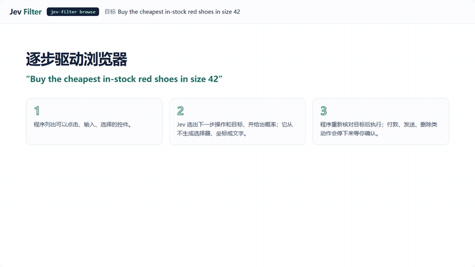

<p align="center">
  
</p>

<p align="center">
  <a href="https://github.com/apixly-ai/jev-filter/actions/workflows/ci.yml"></a>
  <a href="https://github.com/apixly-ai/jev-filter/releases"></a>
  <a href="https://www.npmjs.com/package/@apixly/jev-filter"></a>
  <a href="LICENSE"></a>
</p>
<p align="center">
  <a href="README.md">English</a> · <a href="#快速开始">快速开始</a> · <a href="https://apixly-ai.github.io/jev-filter/docs/index.zh-CN.html">中文文档</a> · <a href="docs/agent-quickstart.zh-CN.md">接入 AI</a> · <a href="docs/benchmarks.zh-CN.md">Benchmark</a> · <a href="https://github.com/apixly-ai/jev-filter/releases">版本发布</a>
</p>

**把关键信号交给 AI，把判断证据留给你。** Jev Filter 在整批工具输出进入主模型之前，将它变成精简、类型化的判断结果。命令、代码、日志和网页记录保留在程序内部；主模型只接收相关证据，以及需要它接管的 ID。

**返回工具上下文减少 91.6–97.2%，24/24 组选中 ID 全部正确。** **2026-10-04** 实测：三个合成场景、两个主模型、每个实验臂重复两次，共 24 次真实 agent 运行。完整原文仍可按 ID 回查。[真实调用证据与代价 →](#实测优势)

## 让主模型的每一分注意力都更有价值

| **聚焦关键内容** | **每个判断都有出处** | **让程序完成并验证目标** |
|---|---|---|
| 按任务与上下文筛选大量记录，主模型把注意力放在选中的证据与困难项。 | 类型化答案、来源 ID、本地原文和收据。缺事实、不确定与部分失败都明确保留。 | 对短浏览器或桌面目标，Jev 在观察到的控件中选择；程序拥有执行权、安全门禁与终态验证。 |

形成清楚的分工：**程序采集与验证，Jev 做重复语义判断，主模型规划、推理与写作。** 自动合批减少重复输入，最多 30 个请求并发，不用结果缓存掩盖新观察。

## 在 AI 实际工作的地方，证明价值

**让对话接收信号，让完整轨迹随时可查。** 最新整段 A/B 中，过滤后的 agent **12/12** 次完整完成任务，原文臂为 **11/12**；全部 24 次运行都返回了正确 ID 集。测量包含采集、真实主模型调用工具及后续处理。

**找到更多你真正要查的行为。** 可选代码召回结合 Jev 原生筛选，正确匹配 **4/12 → 10/12**，误报为零。有界 diff 筛查在两次重复中都选对全部四个目标变更，原文与来源新鲜度仍可独立核对。

**沿用你已有的接入方式。** Python CLI、全新安装的已发布 npm 包、JavaScript、官方 MCP、本地网页提取与 survey 的 **13/13 项付费 E2E 检查通过**。共享证据契约，直接接进现有 agent。

最强的实测收益是上下文缩减。**六个整段对比单元中有五个更慢；低价主模型的 `exec` 冷输入 API 等价费用高了 1.1%。** 上下文变小，不保证耗时或实际账单下降。[数字、方法与负面结果 →](docs/benchmarks.zh-CN.md)

[接入示例 →](docs/agent-quickstart.zh-CN.md#javascript-与-mcp) · [命令参考 →](docs/cli.zh-CN.md)

## 快速开始

**Node.js 22+ · macOS / Linux · npm 发行包内置 Python。** Windows 可用 WSL，或[原生安装 Python 包](docs/getting-started.zh-CN.md#python-工作流继续使用原接口)。安装与 `doctor` 可离线完成；推理需要 TypeSafe Jev API key。

```sh
npm install -g @apixly/jev-filter
jev-filter doctor
```

在任意目录运行：

```sh
export TYPESAFE_API_KEY='your-key'

jev-filter query --input - --mode choose \
  --task '选择当前仍未恢复的 DNS 故障' <<'JSON'
[
  {"id":"a","text":"DNS 已恢复，请求成功。"},
  {"id":"b","text":"DNS 仍失败，无法建立连接。"}
]
JSON
```

预期选中 `b`，以下省略诊断元数据：

```json
{"selected_ids":["b"],"review_ids":[],"complete":true}
```

处理实际批量数据时，在原文进入聊天之前，让 CLI 在**一次调用**内完成采集与筛选：

```sh
jev-filter exec --task '找出尚未恢复的网络故障' \
  --analysis analysis.json -- your-collector --json
```

从[可复制的分析契约](docs/recipes.zh-CN.md)开始。退出码 **2** 仍需解析结果包：`complete=false` 与 `review_ids` 表示需要关注。小例子用于了解接口；精确路径、ID、selector、计算和少量短输出通常使用原生工具。[安装、密钥与结果处理 →](docs/getting-started.zh-CN.md)

## 实测优势

最新 **付费真实调用 · 2026-10-04**。公开固定输入、源码哈希、逐次用量、整段耗时与失败；每个结果对应明确范围。

| 优势 | 实测结果 | 范围与代价 |
|---|---|---|
| **聚焦主模型上下文** | **返回工具上下文减少 91.6–97.2%**；过滤臂完整完成 **12/12**，原文臂 **11/12**；**24/24** 组 ID 全对。 | 24 次真实 agent 运行、三个合成场景、两个主模型、每臂两次。五个单元慢了 **0.1–18.4%**；冷输入 API 等价费用从**下降 23.2% 到增加 1.1%**。订阅实际账单未知。[数据](benchmarks/results/2026-10-04-live-operations-summary.json) |
| **找回更多相关代码** | 正确匹配 **4/12 → 10/12**，**误报为零**。 | 精确候选与可选召回均经过原生语义筛选。返回上下文 **5,284 → 9,706 bytes**；词法完全无交集仍漏掉。[数据](benchmarks/results/2026-10-04-live-records.json) |
| **定位真正要查的变更** | 两次重复都选对 **4/4** 个目标变更；相比保留全部文件，返回上下文**减少 23.9%**。 | 八个合成文件、两次重复。语义筛选增加模型用量，整段耗时中位 **503 → 1,465 ms**。[数据](benchmarks/results/2026-10-04-live-records.json) |
| **高效处理重复判断** | 合批并发比单条并发的 Jev 输入 tokens **少 56.5%**，该操作**快 61.2%**。 | 96 条合成记录 × 两个判断，每臂三次，**12/12** 次结果精确。只测 Jev 阶段，不代表整轮 agent 提速；并发上限 12。[数据](benchmarks/results/2026-10-04-live-batching.json) |
| **验证实际接入链路** | **13/13 项付费 E2E 通过**，包含 MCP 精确证据回查和 **64/64** 条 survey 主题标注。 | Python CLI、全新 npm **0.4.0** JS/原生包、官方 MCP、本地 Chromium 提取与 survey。小型合成夹具；这些公开适配层没有暴露提供方返回的实际模型 ID。[数据](benchmarks/results/2026-10-04-live-interfaces.json) |
| **走进滚动容器找到目标** | 同一严格 **0.55 / 0.10** 策略下，嵌套滚动验证完成 **0/3 → 3/3**。 | 固定浏览器源码 A/B，由程序补充观察到的容器证据。六次普通目标运行仍需复核；完成更多步骤会增加调用、上下文和耗时。[数据](benchmarks/results/2026-10-04-live-browser-final-ab.json) |

<details>
<summary><strong>查看最新整段图表与可复现数据</strong></summary>


[全部方法与真实调用结果](docs/benchmarks.zh-CN.md) · [逐次 JSON](benchmarks/results/2026-10-04-live-operations.json) · [CSV](benchmarks/results/2026-10-04-live-operations.csv) · [复现脚本](benchmarks/operations.py)

</details>

<details>
<summary><strong>早期证据：离线契约、合批与开放网站限制</strong></summary>

| 实验 | 对应日期的结果 | 范围 |
|---|---|---|
| 离线发版契约 · 2026-10-04 | 预期行为 **3/13 → 13/13**；错误夹具动作 **3 → 0**。 | 构造响应，未调用模型；复核与诊断上下文增加。[数据](benchmarks/results/2026-10-04-decisions.json) |
| Jev 合批 · 2026-09-22 | 输入 tokens **减少 56.5%**；合批并发比单条并发**快 32.4%**。 | 96 条合成记录 × 两个判断，每臂两次；只测 Jev 阶段。[数据](benchmarks/results/2026-09-22-live.json) |
| 历史整段任务 · 2026-09-23 | **返回工具上下文减少 88–97%**。 | 四个合成场景、48 次；费用与耗时各有得失。[数据](benchmarks/results/2026-09-23-operations.json) |
| 历史托管夹具 · 2026-09-30 | 浏览器 **15/15 Camofox**、**18/18 CDP**；桌面 **12/12**。 | 当时的 planner 策略与本地夹具；不能作为当前严格策略或开放网页的完成保证。[数据](benchmarks/results/2026-09-30-hosted.json) |
| 公开网站 · 2026-09-30 | 只读目标完成 **16/48**；去掉访问墙与提供方失败后为 **16/34**。 | 一个环境、24 个目标；自定义控件与验证偏弱。[数据](benchmarks/results/2026-09-30-real-world.json) |

[完整方法与历史数据](docs/benchmarks.zh-CN.md)。最新浏览器实验保留失败的候选裁剪变体与未知提供方尝试；安全停下不等于目标已完成。

</details>

## 看程序如何把目标变成可验证的结果

<p align="center">
  <a href="https://apixly-ai.github.io/jev-filter/docs/assets/showcase/index.html?lang=zh"></a>
</p>

每一步先观察页面或窗口，让 Jev 在程序枚举的操作与控件里选择，重新核对目标，再执行和验证。模型输出不会变成 selector、坐标、命令或未经检查的文字。不可逆动作会暂停等待确认。

```sh
jev-filter browse --url https://shop.example/ \
  --goal 'Find in-stock red shoes in size 42' \
  --value query='red shoes' --verify-text 'Search results'
```

把示例网址替换成允许测试的页面，并提供有意义的校验条件。`browse`、`desktop` 必须同时满足 **`status: done` 与独立终态验证**；`extract`、`survey` 要求 `ok` 且 `complete`。选中动作或模型单独返回 `DONE` 都不是完成证明。独立的[主模型接管参考](docs/benchmarks.zh-CN.md) 在严格复核后达成 **6/6** 个预期结果；它增加明显的主模型耗时，属于参考集成，不是产品内置自动回退。

[交互式回放：浏览器、桌面、调研](https://apixly-ai.github.io/jev-filter/docs/assets/showcase/index.html?lang=zh) · [录制方法](docs/showcase.zh-CN.md) · [安全门禁与限制](docs/hosted-execution.zh-CN.md)

## 一套核心，接入现有 AI

**CLI · Python · JavaScript / TypeScript · MCP。** 可以调用 shell、嵌入 `jev_filter.batch.run`、从 `@apixly/jev-filter` 导入 `createClient`，或向 MCP host 提供四个只读工具。每条接入路线复用同一核心，保留证据与部分结果。[JavaScript 与 MCP 示例 →](docs/agent-quickstart.zh-CN.md#javascript-与-mcp)

配套 skill 支持 Codex、Claude Code 或兼容的工具框架：

```sh
# Codex；Claude Code 使用 ~/.claude/skills。
mkdir -p ~/.codex/skills
cp -R "$(npm root -g)/@apixly/jev-filter/skills/jev-filter" ~/.codex/skills/
```

给 agent 一段明确的使用规则：

```text
大量记录需要标准明确的语义判断时使用 jev-filter。
传入任务、范围、排除条件、成功标准和有来源的已知事实。
让采集 → 分析 → 精简输出在一次工具调用内部完成。
复核未确定的 ID；精确查询和少量短结果使用原生工具。
不重复已完成判断，不再次封装已有 Jev 流程。
```

Jev 不会自动继承聊天历史。共享事实放 `context`，历史随各记录传入，并声明必要字段。授权与执行验证继续由现有程序负责。[五分钟接入 →](docs/agent-quickstart.zh-CN.md) · [完整接入指南 →](docs/agents.zh-CN.md)

<details>
<summary><strong>按任务选择入口</strong></summary>

| 任务 | 命令 / API | 指南 |
|---|---|---|
| 采集可信命令的输出 | `exec` | [采集命令](docs/recipes.zh-CN.md) |
| 筛选或分类 JSON 候选 | `query` | [结合上下文选择](docs/recipes.zh-CN.md) |
| 定位代码行为 | `code-search` | [完整代码符号](docs/recipes.zh-CN.md) |
| 检查有界 Git 变更 | `diff-review` | [命令参考](docs/cli.zh-CN.md) |
| 归类关联的 JSON/JSONL 事件 | `triage` | [关联日志](docs/recipes.zh-CN.md) |
| 选择本地 Camofox 页面控件 | `locate` | [网页选择](docs/recipes.zh-CN.md) |
| 完成短网页目标或采集页面记录 | `browse` · `extract` | [浏览器托管执行](docs/hosted-execution.zh-CN.md) |
| 完成 Windows/macOS 应用目标 | `desktop` | [桌面](docs/hosted-execution.zh-CN.md#桌面desktop) |
| 对大量记录分类汇总 | `survey` | [大量记录](docs/hosted-execution.zh-CN.md#大量记录survey) |
| 在 Python 中嵌入类型化推理 | `jev_filter.batch.run` | [Python 接入](docs/agents.zh-CN.md) |
| 离线评测标注判断 | `eval` | [评测示例](docs/integrations.zh-CN.md#离线评测保存的判断) |
| 接入 Node.js 程序或 MCP host | `createClient` · `mcp` | [接入示例](docs/agent-quickstart.zh-CN.md#javascript-与-mcp) |

</details>

## 从输入到发行，每一步都可核对

- **有界推理，无结果缓存。** 自动合批，最多 30 个请求并发；不缓存判断结果。
- **本地证据与数值统计。** 私有原文可按 ID 回查；可选[本地看板](docs/statistics.zh-CN.md)展示用量、未知项和负净值，输入等价值估算不作为账单节省。
- **明确的信任边界。** 推理输入会发送到 TypeSafe；`exec` 执行你的可信命令，不是沙箱。托管执行保留新鲜度、来源和桌面安全门禁。[安全策略](SECURITY.zh-CN.md)
- **可移植、可核验的发行包。** Python 核心、内置运行时的 npm 平台包、校验和与构建来源。[发行与恢复](docs/distribution.zh-CN.md)

旧 `jev-context` 命令与 Python imports 保持兼容。Jev Filter 由 **Apixly / JIA-ss** 独立维护，与 TypeSafe 无隶属关系。

## 参与开发

```sh
git clone https://github.com/apixly-ai/jev-filter.git
cd jev-filter
python -m venv .venv && . .venv/bin/activate
python -m pip install -e '.[code,dev]'
sh scripts/check.sh
npm test
```

[贡献指南](CONTRIBUTING.zh-CN.md) · [开发与发布](docs/development.zh-CN.md) · [更新日志](CHANGELOG.zh-CN.md) · [反馈问题](https://github.com/apixly-ai/jev-filter/issues/new/choose) · [MIT 许可证](LICENSE)
