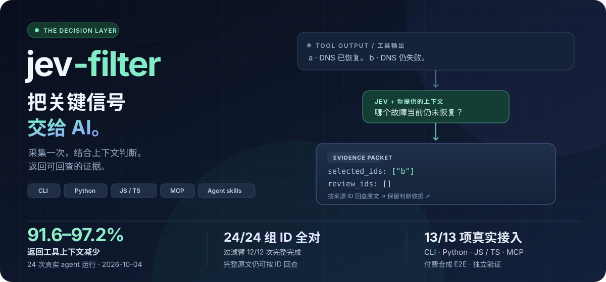

<p align="center">
  
</p>
<p align="center">
  <a href="README.md">English</a> · <a href="#快速开始">快速开始</a> · <a href="docs/agent-quickstart.zh-CN.md">接入 AI</a> · <a href="docs/benchmarks.zh-CN.md">Benchmark</a> · <a href="https://apixly-ai.github.io/jev-filter/docs/index.zh-CN.html">中文文档</a> · <a href="https://github.com/apixly-ai/jev-filter/releases">版本发布</a>
</p>
<p align="center">
  <a href="https://github.com/apixly-ai/jev-filter/actions/workflows/ci.yml"></a>
  <a href="https://github.com/apixly-ai/jev-filter/releases"></a>
  <a href="LICENSE"></a>
</p>

**放在工具与主模型之间的语义筛选器兼托管执行器。** 在 CLI 内部采集命令输出、搜索结果、网页控件或日志，用 Jev 根据 AI 提供的任务与上下文判断，再返回相关证据和待复核 ID，减少整批原始结果进入主模型上下文。**0.3 新增：**让 CLI 自己操作网页或桌面应用，或对上万条记录做调研汇总，决策同样是类型化、可复核的。[托管执行 →](#托管执行浏览器桌面与数据)

## 本地节省统计看板

配置本地数值账本后，运行 `jev-filter stats dashboard`（8765 被占用时自动选择空闲端口）即可自动打开浏览器，查看估算输入 token 减少量、美元输入价值、Jev 成本与净值，按模型/日期筛选，并导出 JSON 或独立 HTML。未知和负收益明确保留；这些是输入等价值估算，不是账单节省。参见[配置与统计口径](docs/statistics.zh-CN.md)。

## 三个核心优势

- **让主模型少读无关内容。** 先筛选再返回，需要时按 ID 取回原文。新完成的 48 次整段任务测试中，返回上下文减少 **88–97%**。[证据与代价 →](docs/benchmarks.zh-CN.md)
- **减少 Jev 的重复输入开销。** 自动合批，最多 30 个请求并发。公开测试输入 token 减少 **56.5%**，相比单条并发快 **32.4%**。[复现方法 →](docs/benchmarks.zh-CN.md)
- **规则由 AI 控制，结果可复核。** 自定义上下文、问题与输出；缺事实保留 `REVIEW`。**8/8 组测试结果正确**，三条已安装流程通过验收。[公开数据](benchmarks/results/2026-09-22-live.json) · [集成证据](benchmarks/results/2026-09-22-migration.json)

适合 **记录多、语义判断重复、标准明确** 的任务。精确路径、ID、selector、计算和少量短结果优先用原生工具；开放推理和写作仍交给主模型。

## 托管执行：浏览器、桌面与数据

Jev 负责选，程序负责做。每一步先观察页面或窗口，用一次 Jev 请求在程序枚举的控件里选出下一步操作和目标，重新核对目标后再执行。Jev 从不产出选择器、坐标、命令或文字。

```sh
# 浏览器：私有无头 Chrome/Edge，或 --cdp-port / Camofox
jev-filter browse --url https://shop.example/ --goal 'Buy the cheapest in-stock red shoes in size 42' \
  --value query='red shoes'            # 在“Place order”前暂停并给出 confirm_token

# 桌面：Windows UI Automation 或 macOS 辅助功能，OCR 兜底
jev-filter desktop --window '^Invoice Tool$' --goal 'Choose the Pro plan and save' --verify-text 'saved'

# 数据：对大量记录做类型化判断，由代码汇总
jev-filter survey --input tickets.jsonl --spec survey.json --format md
```

- **安全由结构保证。** 支付、发送、删除类动作会暂停等待确认；导航限制在起始来源内；密码和验证码一律交还，不代为处理；桌面执行拒绝终端和凭据管理器，出现 STOP 文件即停止。
- **在本地合成夹具上用真实 Jev 实测**（每项三轮，成功与否由程序校验，不以模型的 DONE 为准）：

| 线 | 任务数 | 通过 | 单任务耗时中位范围 |
|---|---:|---:|---|
| 浏览器（Camofox） | 5 | 15/15 | 0.7–13.7 s |
| 浏览器（Chromium，CDP） | 6 | 18/18 | 0.7–3.9 s |
| 桌面（Windows UIA + OCR） | 4 | 12/12 | 0.8–5.6 s |
| survey（10,000 条） | 1 | 主题 100.0%，情绪 95.7% | 19.6 s，375 次请求，约 $0.22 输入费用 |

这些是小规模合成测试，记录由模板生成、难度较低，展示的是机制和成本，不代表开放网络上的成功率。[使用说明与限制 →](docs/hosted-execution.zh-CN.md) · [测试方法 →](docs/benchmarks.zh-CN.md#托管执行2026-09-30)

## 实测收益与代价


**48 次真实 agent 运行：**Astra 和 Luna、四类场景、原生/筛选两组、各三轮。
所有运行都选对预期 ID；原生组四次要求额外复核，筛选组没有。工具返回上下文减少 **88–97%**，
冷输入 API 等价费用从 **下降 20.8% 到上升 0.6%**，耗时有升有降。这是小规模合成测试，不是生产保证。

[方法与完整结果](docs/benchmarks.zh-CN.md) · [逐次 JSON](benchmarks/results/2026-09-23-operations.json) · [CSV](benchmarks/results/2026-09-23-operations.csv) · [判断证据](benchmarks/results/2026-09-23-decisions.json)

<details>
<summary><strong>自动合批和并发带来了什么</strong></summary>


96 条合成记录，每条两个条件，每组两轮。合批使 Jev 输入 token 减少 **56.5%**，
合批并发比单条并发快 **32.4%**。这是 Jev 阶段，不是主模型整轮加速。
[原始数据](benchmarks/results/2026-09-22-live.json) · [复现](docs/benchmarks.zh-CN.md)

</details>


## 快速开始

**Node.js 22+ · macOS / Linux · npm 发行包不需要另外安装 Python。** Windows 可用 WSL，或从 GitHub Release 的 wheel / `pip install 'jev-filter[code] @ git+https://github.com/apixly-ai/jev-filter.git@v0.2.3'` 原生安装 Python 包（Python 3.10+；`search` 需要 PATH 里有 `rg`；未发布到 PyPI）。只有实际推理才需要 TypeSafe Jev API key。

通过 npm 安装：

```sh
npm install -g @apixly/jev-filter
jev-filter doctor
```


配置 key 后，在**任意目录**运行这个完整例子：

```sh
export TYPESAFE_API_KEY='your-key'

jev-filter query --input - --mode choose \
  --task '选择当前仍未恢复的 DNS 故障记录' <<'JSON'
[
  {"id":"a","text":"之前 DNS 失败，现已恢复，请求成功。"},
  {"id":"b","text":"DNS 解析仍失败，无法建立连接。"}
]
JSON
```

预期选中 `b`，以下省略了诊断元数据：

```json
{"selected_ids":["b"],"review_ids":[],"complete":true}
```

小例子用于学习接口；这么短的实际输入通常直接用原生工具更合适。处理真实批量数据时，让 CLI 自己执行采集命令：

```sh
jev-filter exec --task '找出尚未恢复的网络故障' \
  --analysis analysis.json -- your-collector --json
```

先复制 [分析契约示例](docs/recipes.zh-CN.md)，再替换采集命令。命令以参数数组透传，不隐式启动 shell。[如何读结果与退出码 →](docs/getting-started.zh-CN.md#读懂结果)

## 接入你的 AI

能执行命令的 AI 都可以接入。不需要再启动一个代理，也不要求先部署 MCP 服务。

**1. 安装配套 skill。** npm 全局安装后，以 Codex 为例：

```sh
mkdir -p ~/.codex/skills
cp -R "$(npm root -g)/@apixly/jev-filter/skills/jev-filter" ~/.codex/skills/
```

其他 AI 将同一个 skill 放入其支持的目录即可。[Claude Code 与通用工具接入 →](docs/agents.zh-CN.md)

**2. 给 AI 一段明确的使用规则。**

```text
大量记录需要标准明确的语义判断时使用 jev-filter。
传入任务、范围、排除条件、成功标准和有来源的已知事实。
让采集→分析→精简输出在一次工具调用内部完成。
复核未确定的 ID，不重复判断已完成项，不再次封装已有 Jev 流程。
精确查询和少量短结果使用原生工具。
```

**3. 把决定答案所需的上下文传进去。** Jev 不会自动继承聊天历史。共享事实放 `context`，各记录的历史随记录传入，用必要字段声明拦住缺信息的请求。问题、筛选、排序和输出投影都由调用者控制。[完整接入指南 →](docs/agents.zh-CN.md) · [上下文契约 →](docs/context-contract.zh-CN.md)

## 按任务选择入口

| 你要处理什么 | 使用 | 示例 |
|---|---|---|
| 自定义命令的大量输出 | `exec` | [采集命令](docs/recipes.zh-CN.md) |
| JSON 候选记录 | `query` | [结合上下文选择](docs/recipes.zh-CN.md) |
| 广泛关键词命中的源代码 | `code-search` | [完整代码符号](docs/recipes.zh-CN.md) |
| 本地 Camofox 页面上的控件 | `locate` | [网页选择](docs/recipes.zh-CN.md) |
| 多请求的 JSON/JSONL 日志 | `triage` | [关联事件](docs/recipes.zh-CN.md) |
| 让 CLI 完成一个网页目标 | `browse` | [托管执行](docs/hosted-execution.zh-CN.md#浏览器browse) |
| 从网页取结构化数据 | `extract` | [页面数据](docs/hosted-execution.zh-CN.md#页面数据extract) |
| 在 Windows/macOS 应用里完成目标 | `desktop` | [桌面](docs/hosted-execution.zh-CN.md#桌面desktop) |
| 上万条记录要分类汇总 | `survey` | [大量记录](docs/hosted-execution.zh-CN.md#大量记录survey) |
| 已有类型化 Jev 流程 | Python `batch.run` / CLI `batch` | [程序内接入](docs/agents.zh-CN.md) |

[全部参数](docs/cli.zh-CN.md) · [原文复核](docs/getting-started.zh-CN.md#读懂结果) · [架构](docs/architecture.zh-CN.md)

## 我们自己也在用

资料标注、Telegram 维护计划和 SRE 分流已保留原接口，并用真实 Jev 调用、合成数据通过验收。私有身份、密钥和生产数据不进入开源仓库。

- **不使用结果缓存。** 明确上下文、采集边界、失败项和模型用量。
- **受保护的发布。** 必须通过 CI/安全检查，发布标签不可改写，安装包附校验和与来源证明。
- **可复用的内核。** Python library 与 npm CLI；自动合批，最多 30 个在途请求。
- **明确的边界。** 参与推理的输入会发送给 TypeSafe；`exec` 执行你提供的命令，不是沙箱；托管执行只执行程序枚举出的动作，不可逆动作会先暂停。[安全说明 →](SECURITY.zh-CN.md)

完成一次 npm 包信任配置后，GitHub Release 成功会自动通过 OIDC 发布五个包，并从注册表全新安装验收，无需保存长期 npm token。参见[首次配置与续办](docs/distribution.zh-CN.md#首次-npm-信任配置)。

## 参与开发

```sh
git clone https://github.com/apixly-ai/jev-filter.git
cd jev-filter
python -m venv .venv && . .venv/bin/activate
python -m pip install -e '.[code,dev]'
sh scripts/check.sh
npm test
```

[贡献指南](CONTRIBUTING.zh-CN.md) · [开发与发布](docs/development.zh-CN.md) · [项目治理](GOVERNANCE.zh-CN.md) · [更新记录](CHANGELOG.zh-CN.md) · [报告问题](https://github.com/apixly-ai/jev-filter/issues/new/choose)

**Apixly / JIA-ss** 维护 · [MIT](LICENSE) · 独立于 TypeSafe。
