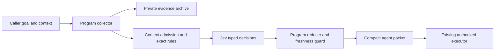
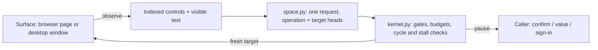

# Architecture

[简体中文](architecture.zh-CN.md)

Collection and inference stay inside the program. The main agent sees the selected
packet, not a raw-output roundtrip followed by a second classification.

`analysis.py` validates/plans/reduces. `pool.py` runs independent requests with up to
30 workers. `provider.py` owns fixed-origin HTTPX transport, credential loading and
bounded retries. `command.py` captures trusted argv under a byte/time budget.
`tools.py` owns specialized collectors and guards. `batch.py` preserves existing
native question contracts and packs only compatible schemas with isolated state.

There is no result cache. Each live question is evaluated again. Receipts are
inspectable evidence, not replayed authority. Unknown failed usage is marked
incomplete; returned token usage is counted once, never replicated per record.

Source text can contain prompt injection or incorrect claims. Typed outputs and
program checks reduce the execution surface but do not make model judgments true.
Commands are caller-authorized, not generated by Jev. Read SECURITY.md for the
precise trust boundaries.

## Hosted execution

| Module | Responsibility |
|---|---|
| `act/cdp.py` | Standard-library DevTools WebSocket client and private headless browser launcher |
| `act/page.js` | In-page observation, freshness guards, target resolution, extraction |
| `act/browser.py` | `CDPPage` and `CamofoxPage` transports with one observe/fresh/act contract |
| `act/desktop*.py` | Desktop surface, Windows UI Automation and macOS AX backends, safety gates |
| `act/ocr.py` | OCR fallback (Windows.Media.Ocr, Vision) with pixel-hash freshness |
| `act/space.py` | Action space, question construction, irreversible gate |
| `act/kernel.py` | The observe → decide → execute → verify loop |
| `survey.py` | Streaming inputs, screening, packed evaluation and code-side aggregation |

The execution loop reuses `provider.py` for every Jev request, so credentials, retries and
usage accounting behave exactly as in the filtering commands. See
[hosted execution](hosted-execution.md) for behavior and limits.
