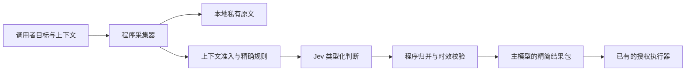
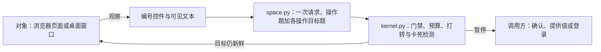

# 架构与职责

[English](architecture.md) · [中文文档首页](index.zh-CN.md)

采集与推理均在程序内完成，主模型接收筛选结果，避免原文先进入对话后又重复分类。

| 模块 | 职责 |
|---|---|
| `analysis.py` | 验证分析契约、规划与归并判断 |
| `pool.py` | 最多 30 个独立请求并发 |
| `provider.py` | 固定 API 地址、凭据、连接池与有界重试 |
| `command.py` | 在时间和字节预算内采集可信命令 |
| `tools.py` | 专用采集器和来源时效校验 |
| `batch.py` | 保留已有类型化请求接口，只合并兼容结构并隔离记录状态 |

没有结果缓存，每次真实问题重新判断。凭据文件用于复核，不是可重放的授权。
失败且未知的用量标为不完整；返回 token 用量只计算一次，不按记录重复累计。

原文可能包含提示词注入或错误声明。类型化输出和程序校验缩小了执行面，但不能证明模型答案为真。
命令由调用者授权，不由 Jev 生成。[完整安全边界](../SECURITY.zh-CN.md)。

## 托管执行

| 模块 | 职责 |
|---|---|
| `act/cdp.py` | 标准库实现的 DevTools WebSocket 客户端与私有无头浏览器启动器 |
| `act/page.js` | 页面内观察、新鲜度校验、目标解析与结构化提取 |
| `act/browser.py` | `CDPPage` 与 `CamofoxPage` 两种传输，同一套观察、校验、执行接口 |
| `act/desktop*.py` | 桌面对象、Windows UI Automation 与 macOS AX 后端、安全门禁 |
| `act/ocr.py` | OCR 兜底（Windows.Media.Ocr、Vision），点击前按像素哈希校验 |
| `act/space.py` | 动作空间、出题、不可逆判定 |
| `act/kernel.py` | 观察、决策、执行、校验的循环 |
| `survey.py` | 流式输入、筛选、打包推理与代码侧汇总 |

执行循环的每次 Jev 请求都复用 `provider.py`，凭据、重试与用量统计和过滤类命令完全一致。行为与限制见[托管执行](hosted-execution.zh-CN.md)。
