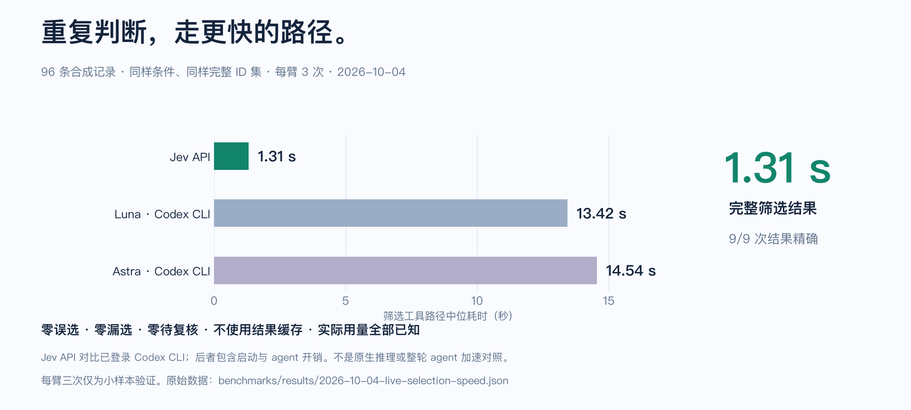
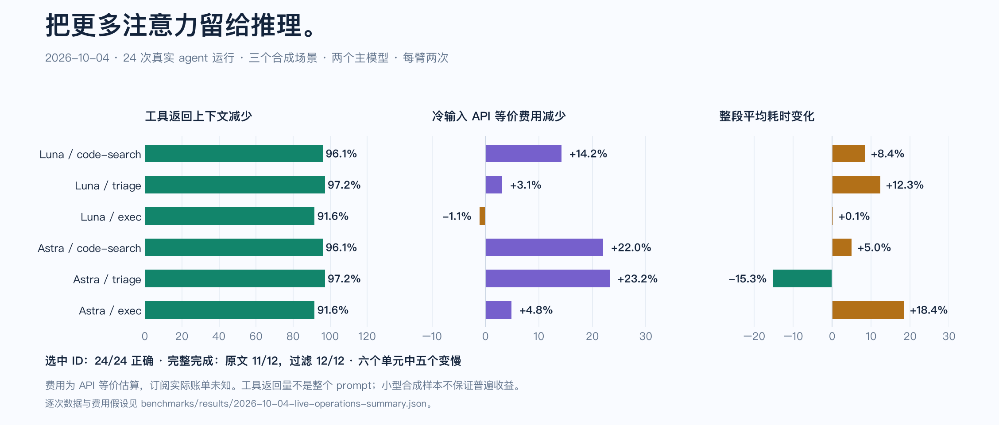

# 性能、费用与质量测试

[English](benchmarks.md) · [中文文档首页](index.zh-CN.md)

## 最新付费真实调用 · 2026-10-04

**96 条记录，中位 1.313 秒筛完，选中 ID 完全一致。** 新增同输出实验对比可用的
Jev API 与已登录 Codex CLI 筛选路径，全部 **9/9** 次结果精确且完整。这个阶段结果
与下面的整轮 agent 上下文 A/B 分开。

**返回工具上下文减少 91.6–97.2%，完整证据仍可回查。** 最新整段结果覆盖
**24 次真实主模型运行**：三个固定合成场景（`code-search`、`triage`、`exec`），
两个主模型（`gpt-5.6-luna`、`gpt-6-astra`），原文/过滤两个实验臂，每个单元重复两次。
过滤臂完整完成 **12/12**，原文臂 **11/12**；全部 **24/24** 都选对预期 ID 集。
原文 Astra triage 有一次 ID 正确，但完整响应契约失败，仍计入分母。

### 同输出筛选：实测执行路径的速度

[同输出数据](../benchmarks/results/2026-10-04-live-selection-speed.json) 使用相同的 96 条
合成记录、两个原子语义条件，预期输出为 48 个匹配 ID。Jev 通过自动合批 API 筛选；
已登录 Codex CLI 按 **medium 推理、不使用工具**直接筛选传入的记录。
三个重复轮次轮换实验臂顺序，每次重新运行，不缓存推理结果。
夹具把**八个简单中英模板各重复十二次**，只有服务 ID 不同，覆盖清楚的当前/历史与
响应前/后区分，不是 96 个独立困难用例。

| 实测路径 | 筛选耗时中位 | 实测范围 | 精确完整结果 |
|---|---:|---:|---:|
| **Jev `jev-1.13.0` · 自动合批 API** | **1.313 秒** | 1.238–1.375 秒 | **3/3** |
| Luna `gpt-5.6-luna` · 已登录 Codex CLI | 13.421 秒 | 13.210–13.932 秒 | 3/3 |
| Astra `gpt-6-astra` · 已登录 Codex CLI | 14.543 秒 | 14.333–15.593 秒 | 3/3 |

**这是执行路径筛选延迟，不是模型原生/API 延迟或整轮 agent 提速。** Jev 计时包含
规划、传输、类型化解析与程序精简；Codex 包含 prompt 序列化、进程启动、提供方/agent
回合及最终响应。夹具目录准备单独计时并排除。原生推理与 CLI 启动开销无法分别观察，
逐请求延迟未采集；Jev 后面没有主模型续跑。**没有测试主模型的直接 API 路径。**
每臂三次是 smoke 样本，不是置信区间或
跨工作量保证，重复的简单模板也限制推广。没有推理结果缓存，不代表提供方没有内部缓存。



九次运行都返回相同的 **375 bytes** 规范化判断，误报、漏选、复核、超时、失败请求及
未知用量尝试均为零。这是相同输出与原始证据，**不是相同的序列化 prompt**：
记录本身 **12,351 bytes**；每次 Jev 类型化请求合计 **93,226 bytes**，主模型 prompt
各为 **13,224 bytes**，另有 **196 bytes** 输出 schema 与 CLI 自带 harness。
Jev 每次两个实际请求；主模型每次返回一个回合，底层实际请求数未提供。

| 路径 | 三次实际输入 / 其中缓存 / 输出 tokens |
|---|---:|
| Jev | **91,086 / 未提供 / 27,546** |
| Luna | 59,052 / 0 / 788 |
| Astra | 66,216 / 0 / 492 |

这组同输出实验中，**Jev 输入 tokens 比两个主模型路径都多**；输出用量也包含逐记录的
类型化判断，而非只有最终 ID 列表。用量完整，实际费用仍为 `null`。主模型使用订阅认证，
这些耗时与 tokens 没有建立账单节省。Jev 实际响应模型为 `jev-1.13.0`；CLI 记录请求的
主模型名称，没有独立暴露提供方返回的实际模型 ID。

[报告与限制](https://github.com/apixly-ai/jev-filter/blob/main/benchmarks/results/2026-10-04-live-selection-speed-summary.md) ·
[独立用量收据](../benchmarks/results/2026-10-04-live-selection-speed-usage.json) ·
[可复现脚本](../benchmarks/selection_speed.py)

### 整段任务：上下文明显缩减，耗时各有得失

| 主模型 / 场景 | 工具上下文减少 | 平均耗时 原文 → 过滤 | 冷输入 API 等价费用变化 | 完整完成 原文 / 过滤 |
|---|---:|---:|---:|---:|
| Luna / code-search | 96.1% | 14.87 → 16.12 s | −14.2% | 2/2 / 2/2 |
| Luna / triage | 97.2% | 15.21 → 17.09 s | −3.1% | 2/2 / 2/2 |
| Luna / exec | 91.6% | 15.82 → 15.84 s | **+1.1%** | 2/2 / 2/2 |
| Astra / code-search | 96.1% | 18.51 → 19.44 s | −22.0% | 2/2 / 2/2 |
| Astra / triage | 97.2% | 23.12 → 19.58 s | −23.2% | 1/2 / 2/2 |
| Astra / exec | 91.6% | 18.73 → 22.19 s | −4.8% | 2/2 / 2/2 |

六个单元有五个慢了 **0.1–18.4%**；只有 Astra triage **快 15.3%**，它的原文臂包含
那次响应契约失败。两次重复是 smoke 对比，不是统计充分的延迟研究。夹具准备单独记录、
不计入任务耗时；采集、Jev 推理、真实主模型的 shell 工具调用和后续处理一起计时。
工具上下文字节衡量工具返回量，不是整段模型 prompt；主模型输入还包含 harness 与固定指令。

每个模型六次原文或六次过滤运行的实际 tokens 合计：

| 主模型 / 实验臂 | 主模型输入 / 其中缓存 / 输出 | Jev 输入 / 输出 |
|---|---:|---:|
| Luna / 原文 | 242,638 / 112,896 / 1,804 | 0 / 0 |
| Luna / 过滤 | 199,220 / 109,824 / 1,478 | 145,014 / 25,086 |
| Astra / 原文 | 277,875 / 111,360 / 925 | 0 / 0 |
| Astra / 过滤 | 227,990 / 144,640 / 891 | 145,014 / 25,086 |

这些运行的提供方用量完整。Codex CLI 使用已配置的账号，**实际订阅账单未知**。
冷输入估算将主模型输入全部按未缓存计价；缓存调整估算使用实际返回的缓存子集。
两者都不是发票。Luna `exec` 的缓存调整等价费用**高了 12.0%**；Astra `exec` 的过滤臂
恰好有更多缓存输入，因此它的 **70.6%** 调整降幅不能全归因于过滤。
费用采用有日期的[2026-10-04 调用方单价快照](../benchmarks/results/2026-10-04-operations-rates.json)。
缺用量或未知账单保持 `null`，不会记成零费用成功。

[逐次 JSON](../benchmarks/results/2026-10-04-live-operations.json) ·
[汇总与精确计算](../benchmarks/results/2026-10-04-live-operations-summary.json) ·
[CSV](../benchmarks/results/2026-10-04-live-operations.csv) ·
[执行脚本](../benchmarks/operations.py)



### 合批：Jev 阶段更快，输入用量更少

[最新原生合批测试](../benchmarks/results/2026-10-04-live-batching.json) 使用 96 条固定合成
记录 × 两个判断、四个实验臂、每臂三次；**12/12** 次选择结果精确，用量完整。
单条并发最多 **12** 个 worker；合批并发只需两个请求与两个 worker，单条臂每次操作有 96 个请求。

| 实验臂 | 整段筛选平均耗时 | 三次重复输入 tokens | 精确结果 |
|---|---:|---:|---:|
| 单条串行 | 29.50 s | 209,244 | 3/3 |
| 自动合批串行 | 1.82 s | 91,086 | 3/3 |
| 单条并发，上限 12 | 3.22 s | 209,244 | 3/3 |
| 自动合批 + 并发 | 1.25 s | 91,086 | 3/3 |

合批输入**减少 56.5%**，合批并发在这个样本中筛选速度为单条并发的 **2.58 倍**，
耗时**减少 61.2%**（**3.215 → 1.246 秒**）。
计时包含规划、原生推理与精简，**没有主模型后续处理**，不能称为整轮 agent 提速。
重复的简单记录模板与网络波动限制推广。全部实验臂提供方返回 **600,660 输入 / 110,964 输出
 tokens**，用量完整，没有未知尝试。这个历史实现的 driver 只暴露请求模型 `jev-1.13.0`，
没有保存响应模型 ID。[执行脚本](../benchmarks/run.py)。

### 记录流程：选得更好，也会增加工作

[原生记录 A/B](../benchmarks/results/2026-10-04-live-records.json) 使用固定合成代码、
Git 完整前后文件与连接阶段记录；计时包含采集 → 准入 → 真实 Jev → 精简 → 来源新鲜度。
这组实验没有主模型后续处理。

| 流程 | 实测质量 | 返回字节 / 整段代价 |
|---|---|---|
| 精确代码候选 vs 可选召回，都经过语义筛选 | 正确匹配 **4/12 → 10/12**；双方误报为零。 | 合计 **5,284 → 9,706 bytes**。每臂六次操作的中位 **854 → 849 ms**，不据此声称提速。 |
| 保留八个变更文件 vs 语义 diff 筛查 | 两次重复都选对四个目标；无关选择 **8 → 0**，没有漏掉目标。 | **11,428 → 8,700 bytes**，减少 23.9%；中位 **503 → 1,465 ms**。 |
| 分离的 18 条校准与 18 条留出记录 | 两次重复中，每臂 **36/36** 个预期判定正确，包含八个复核项。 | 校准选出阈值 **0.0**，这个简单样本**没有额外阈值收益**；每臂都重新真实推理。 |

特意设置的无词法交集代码用例，两个实验臂都漏掉。当前召回扩大词法、符号与调用者候选，
不是穷尽式语义索引。校准与留出是不同原始记录，但都是相似的手写场景；阈值选择不拟合
概率校准器，也没有建立总体准确率保证。

公开的最终系列共 **20 次原生请求**，**35,250 输入 / 5,858 输出 tokens**，实际返回模型
**`jev-1.13.0`**，用量完整，新鲜度检查通过。[固定输入与脚本](../benchmarks/live_records.py)
公开真值、阈值网格、逐次分模型用量和负面结果。

### 接口：通过实际发行链路调用付费模型

[13 项检查全部通过](../benchmarks/results/2026-10-04-live-interfaces.json)。Python CLI
和**全新 registry 安装的 npm 0.4.0** 分别运行 32 条 query、代码召回、八个关联事件与六文件 diff。
独立官方 MCP 客户端协商 **2025-11-25**，运行 filter/search/triage，回查完整原文及 SHA-256。
本地 Chromium 提取选出四个在售 USB-C 台灯；代码解析原始价格，保留三个低于 $35 的产品。
CLI survey **64/64** 主题标注正确，聚合计数完全一致。

这是合成接口检查，不是开放场景准确率；survey 重复八个简单工单模板。
**16 次请求**返回 **71,616 输入 / 17,562 输出 tokens**，用量完整。这些公开接口没有暴露
提供方返回的模型 ID，因此报告将请求模型 `jev-1.13.0` 与未提供的实际模型身份分开。
[执行脚本](../benchmarks/live_interfaces.py) 保留完整合成输出，只替换机器路径与收据位置。

### 浏览器：严格复核、已验证修复与失败实验

[最终固定源码 A/B](../benchmarks/results/2026-10-04-live-browser-final-ab.json) 在同一
`jev-1.13.0`、**最高概率 0.55 / 候选差距 0.10** 策略下，比较已发布 0.4.0 与滚动证据修复源码。
八个本地夹具、每臂三次，使用独立 DOM/存储检查。预期结果 **15/24 → 18/24**：验证完成
**12 → 15**，双方另有**三次正确的不可逆停顿**。这组矩阵错误动作与假完成都为零。

嵌套滚动目标完成 **0/3 → 3/3**。失败基线提前停下，完成后的处理臂在这三次运行中需要
**6 → 21** 次模型调用，耗时中位 **1.33 → 3.25 s**。原有六任务子集的预期结果仍是
**12/18**，其中**六次普通目标运行仍需复核**；已知输入增加 **2.36%**，请求字节增加
**7.52%**，耗时中位增加 **3.58%**。修复保留严格阈值，没有让纯 Jev 完成每个目标。

最终完整矩阵的基线/处理臂为 **171,320 / 202,290 输入 tokens**、**12,012 / 12,818 输出 tokens**，
实际模型均为 `jev-1.13.0`，用量完整。浏览器启动单独记录；导航、观察、判断、动作与独立终态
检查计入整段操作。

早期实验继续公开：[原生 select 候选裁剪](../benchmarks/results/2026-10-04-live-browser-native-select-ab.json)
预期通过 **11/18 → 9/18**；[已满足控件与嵌套滚动](../benchmarks/results/2026-10-04-live-browser-stronger-cases.json)
没有提升通过数；[滚动证据试验](../benchmarks/results/2026-10-04-live-browser-scroll-evidence-ab.json)
包含**一次提供方失败、用量未知**，总费用为 `null`，不是零。这些失败或不完整试验与最终完整矩阵分开。

第一组[仅 benchmark 的主模型接管参考](../benchmarks/results/2026-10-04-live-planner-recovery.json)
达成 **5/6** 个预期结果。一次 Jev 已把正确商品加入购物车，但还没到下单门禁就返回 `DONE`，
被独立检查判为未完成。**模型单独返回 `DONE` 不能当成有效交付。** 首组负面矩阵继续公开。

随后[带独立验证续跑的参考](../benchmarks/results/2026-10-04-live-planner-recovery-verified.json)
达成 **6/6**：三个搜索目标完成、三个正确 `Place order` 停顿；使用固定已发布 0.4.0 和同一严格策略。
它识别并续跑一次提前返回的 Jev `DONE`，没有错误动作、被接受的假完成声明或主模型实际执行工具。
程序拥有观察与候选动作 ID，校验主 planner 返回的 ID/已命名值引用，重新检查新鲜度，执行受门禁保护
的动作，并独立验证终态。[参考流程](../benchmarks/live_planner_recovery.py)。

这是**参考集成，不是发行产品内置的自动主模型回退**。整段耗时 **14.7–51.6 s**，中位 **33.1 s**，
包含接管开销。这六次新运行使用 `gpt-5.6-luna`：**275,556 输入 / 其中缓存 70,400 / 1,155 输出 tokens**；
另有实际 `jev-1.13.0` **180,522 输入 / 11,378 输出 tokens**。用量完整，订阅实际账单未知；结果还单独
保留首组矩阵的用量。可靠接管会增加工作，没有证明普遍便宜或普遍快速的浏览器 agent。

### 包含失败试验的早期累计审计用量

[累计用量台账](../benchmarks/results/2026-10-04-live-total-usage.json) 包含 pilot、重复验证与失败实验，
不仅统计公开成功表格。已知 Jev **2,928,677 输入 / 324,772 输出 tokens**，另有**一次提供方尝试用量未知**。
按所列每百万输入 $0.042，已知输入对应 **$0.123004434 的估算下界**；累计总费用与实际账单仍未知。
主模型账号使用 **1,463,583 输入 / 其中缓存 563,200 / 7,315 输出 tokens**，属于订阅访问，不是已核验的
API 账单。未知不会悄悄记零，不同账务口径也不直接相加。

这份早期系列保持原样。新的同输出速度实验另外增加 **91,086 Jev 输入 / 27,546 输出**
及 **125,268 主模型输入 / 其中缓存 0 / 1,280 输出 tokens**，记录在[独立增量收据](../benchmarks/results/2026-10-04-live-selection-speed-usage.json)。

### 复现新的付费运行

通过 `TYPESAFE_API_KEY` 或 `TYPESAFE_API_KEY_FILE` 提供允许使用的 TypeSafe 测试凭据；
不要放进输入、报告或源码。模型调用须主动启用并计费；使用新输出路径，私有轨迹继续保持私有。

```sh
python -m pip install -e '.[code,dev,docs,browser-test]'
# 独立 MCP 检查还需要官方 mcp 包。
python -m pip install mcp
python -m benchmarks.run --live --records 96 --repeats 3 --parallel-workers 12 \
  --output local-results/batching-new.json
python -m benchmarks.selection_speed --live --records 96 --repeats 3 --workers 12 \
  --models gpt-5.6-luna gpt-6-astra --output local-results/selection-speed-new.json \
  --private-dir ../jev-selection-private-new
python -m benchmarks.live_records --live --repeats 2 --output local-results/records-new.json
python -m benchmarks.live_interfaces --live --output local-results/interfaces-new.json
python -m benchmarks.operations --live --models gpt-5.6-luna gpt-6-astra \
  --cases code-search triage exec --repeats 2 --jev-workers 4 \
  --rate-snapshot benchmarks/results/2026-10-04-operations-rates.json \
  --report local-results/operations-new.json --private-dir local-results/operations-traces
```

这些实验分别回答筛选路径速度、整段主模型上下文、记录判断质量、接口正确性的问题。
同输出速度实验还需要已登录的 Codex CLI，私有目录必须是仓库外的新路径；不要合并分母，
也不要把局部阶段收益当成整轮 agent 节省。

## 0.4 发版证据 2026-10-04

新测试覆盖实际发行程序的契约与接口。以下离线契约 A/B 固定源码，collector 对比使用固定合成输入，**没有语义模型调用**；脚本公开了响应夹具、标注和程序策略。历史 live 推理结果继续保留在后文。

| 范围 | 基线 | 0.4 | 取舍 |
|---|---:|---:|---|
| 脚本化决策/记账行为 | 3/13 符合预期 | 13/13 | 复核 0 → 6；返回字节 4,104 → 7,087 |
| 夹具错误动作 | 3 | 0 | 模糊操作在执行前停下 |
| 代码 collector 平均召回率 | 27.8% | 66.7% | 平均精确率 66.7% → 47.2%；上下文和耗时增加 |
| 浏览器观察/执行契约 | 3/15 | 15/15 | 更完整状态与更多完成路径增加上下文/耗时 |
| freshness 拒绝检查 | 6/6 | 6/6 | 范围、敏感值与来源守卫继续独立 |

决策案例检查错误/未知用量保留和给定概率分布的策略执行，不测 Jev 是否判断正确。无词法线索的检索夹具仍漏掉，这些离线数据不测最终语义精确率，上文提供新的真实调用检查。浏览器用真实本地 Chromium 和固定程序策略，排除启动，不估计开放网站或 Jev 驱动成功率。逐例失败、上下文字节、耗时、源码/脚本哈希与零实际模型用量均保留：[决策](../benchmarks/results/2026-10-04-decisions.json)、[检索](../benchmarks/results/2026-10-04-retrieval.json)、[浏览器观察](../benchmarks/results/2026-10-04-browser-observation.json)。

[接口 E2E](../benchmarks/results/2026-10-04-release-e2e.json) 运行 10 项真实进程检查：CLI 就绪与上下文准入、采集、stdin 日志脱敏、tracked diff、survey 规划、离线评测、MCP stdio、真实 JS 客户端及独立官方 MCP 客户端（2025-11-25、四工具、证据回查）。输入为合成数据，命令明确规划或要求缺失上下文，零模型请求证明接口跑通，不能作为语义质量证据。

```sh
python -m benchmarks.decision_contracts --output decisions.json
python -m benchmarks.retrieval --repeats 5 --output retrieval.json
python -m benchmarks.browser_observation --repeats 3 --output browser.json
python -m benchmarks.release_e2e --output interfaces.json
# 独立客户端检查：另装 mcp 后增加 --official-mcp。
jev-filter eval --input examples/evaluation.json --output heldout.json
```

新提供方比较需安装 `.[code,dev,bench-llm]` 和相应 System One Adapter SDK extra。[固定规划](../benchmarks/results/2026-10-04-provider-plan.json) 记录 32 行、期望结果和完整请求字节，没有推理。`python -m benchmarks.providers --live --provider PROVIDER --model MODEL --output X.json` 明确计费，需指定测试凭据；它只覆盖过滤操作，保留重试总用量和失败未知项，区分 Jev 原生概率与生成式 LLM 概率。离线发版数据没有建立新提供方优势、整轮代理提速或真实账单节省。

默认行为、兼容性及不拟合概率校准器的分组留出评测见[接入与策略契约](integrations.zh-CN.md)。

## 托管执行：2026-09-30

范围：只用本地合成夹具，真实 Jev（`jev-1.13.x`），每个任务三轮。只有最终状态符合预期、**并且**程序对最终状态的校验成立，才算通过：浏览器看 URL 和存储，桌面看窗口文本，survey 对照生成时的真值。模型报告的 DONE 从不算作成功。夹具里的不可逆动作应当暂停（`needs_confirmation`），并核实它确实没有发生。

| 线 | 传输 | 任务 | 期望 | 通过 | 步数中位 | 请求中位 | 耗时中位 | 输入 token 中位 | Jev p50 |
|---|---|---|---|---:|---:|---:|---:|---:|---:|
| browser | camofox | buy-pauses-before-order | `needs_confirmation` | 3/3 | 8 | 9 | 13.7 s | 26,251 | 358 ms |
| browser | camofox | contact-form-scroll | `done` | 3/3 | 9 | 10 | 7.9 s | 27,401 | 350 ms |
| browser | camofox | delete-is-gated | `needs_confirmation` | 3/3 | 0 | 1 | 0.7 s | 1,709 | 703 ms |
| browser | camofox | search-filter | `done` | 3/3 | 6 | 7 | 9.3 s | 23,594 | 336 ms |
| browser | camofox | shadow-dom | `done` | 3/3 | 1 | 2 | 2.0 s | 3,130 | 504 ms |
| browser | cdp | buy-pauses-before-order | `needs_confirmation` | 3/3 | 8 | 9 | 3.9 s | 26,251 | 349 ms |
| browser | cdp | contact-form-scroll | `done` | 3/3 | 6 | 7 | 3.0 s | 21,188 | 345 ms |
| browser | cdp | delete-is-gated | `needs_confirmation` | 3/3 | 0 | 1 | 0.7 s | 1,709 | 726 ms |
| browser | cdp | same-origin-frame | `done` | 3/3 | 1 | 2 | 1.1 s | 3,294 | 527 ms |
| browser | cdp | search-filter | `done` | 3/3 | 5 | 6 | 2.8 s | 20,405 | 356 ms |
| browser | cdp | shadow-dom | `done` | 3/3 | 1 | 2 | 1.2 s | 3,268 | 568 ms |
| browser | cdp | buy-pauses-before-order（无门禁说明） | `needs_confirmation` | 3/3 | 8 | 9 | 4.0 s | 25,211 | 359 ms |
| desktop | windows-uia | advanced-tab | `done` | 3/3 | 3 | 4 | 3.4 s | 8,627 | 442 ms |
| desktop | windows-uia | delete-is-gated | `needs_confirmation` | 3/3 | 0 | 1 | 0.8 s | 2,862 | 706 ms |
| desktop | windows-uia | form-save | `done` | 3/3 | 5 | 6 | 5.6 s | 21,215 | 362 ms |
| desktop | windows-uia | ocr-canvas | `done` | 3/3 | 1 | 2 | 2.1 s | 3,569 | 510 ms |

| 变体 | 记录 | 请求 | 输入 token | 输入费用 | 耗时 | 主题 | 情绪 | 退订意图 | 筛选 |
|---|---:|---:|---:|---:|---:|---:|---:|---:|---:|
| default | 500 | 19 | 257,075 | $0.0108 | 3.5 s | 100.0% | 94.8% | 100.0% | 98.6% |
| no-screen | 500 | 17 | 234,422 | $0.0098 | 2.1 s | 100.0% | 94.7% | 100.0% | – |
| unpacked | 500 | 940 | 590,522 | $0.0248 | 14.0 s | 100.0% | 95.2% | 100.0% | 98.0% |
| default | 10,000 | 375 | 5,192,517 | $0.2181 | 19.6 s | 100.0% | 95.7% | 100.0% | 98.8% |

[逐次 JSON](../benchmarks/results/2026-09-30-hosted.json)

怎么读：

- **浏览器。** 夹具商店有模态 cookie 横幅、自动补全输入框、原生下拉、结果表、带"Place order"和"Remove"按钮的购物车、需要滚动的长表单、开放式 shadow root 和同源 iframe。Camofox 在顶层文档按 CSS 选择器点击，所以 iframe 任务不在该传输上提供；Camofox 每次点击在其内部还要花约 1.7 秒。
- **对照实验。** "无门禁说明"去掉程序追加的那句固定说明（"不可逆步骤由程序把关，照常推进"）。在结果页的单独探针里，以"购买"结尾的目标，没有这句时 Jev 选 BLOCKED 的概率为 0.46–0.60，加上后为 0.09–0.13。整段运行中，低置信度终止回退和按行合并的文本也能把任务救回来，所以端到端差异很小；保留这句是因为它从源头消除了这种失败。
- **桌面。** 一个 WinForms 应用（文本框、下拉列表、复选框、选项卡、列表、"Delete all records"按钮、会弹出模态 MessageBox 的按钮），以及一个按钮完全是画出来的 Tk 画布，靠 OCR 兜底操作。窗口启动时间不计入。
- **survey。** 固定种子生成的合成客服工单（五类主题、三种语气、退订意图、10% 垃圾内容），中英混合。记录由模板生成、难度低，所以这里主题准确率 100% 不说明你的数据会怎样；请用 `--labels` 在自己的标注样本上测。`unpacked` 每条记录单独一个请求（题目相同）；`no-screen` 跳过相关性预筛。无关记录只占 10% 时，预筛花的比省的多；只有无关记录占多数时才划算。

复现（会产生费用，需要 Chromium；Camofox 和桌面线可选）：

```sh
pip install -e '.[dev,browser-test,desktop]'
python -m benchmarks.hosted --live --lines browser,desktop,survey --repeats 3 \
  --camofox --output /tmp/hosted.json
python -m benchmarks.hosted_report /tmp/hosted.json
```

## 真实网站与应用：2026-09-30

上面的夹具结果展示的是机制。这次只读审计要回答的是：同一套代码在真实公开网站和真实 Windows 应用上能走多远。审计中没有购买、发帖或登录，代码也没有改动。汇总数据见 [2026-09-30-real-world.json](../benchmarks/results/2026-09-30-real-world.json)，观察覆盖探针是 `python -m benchmarks.real_world_coverage`。

环境：一台 Windows 11，中国大陆的一个网络，无头 Chrome，视口 1280x900，浏览器语言 zh-CN，`jev-1.13.0`。结果受地区、IP 信誉和时间影响，人机验证的触发率在别处尤其会不同。

**观察覆盖。** 在 40 个公开页面上，用一段独立的页内脚本列出视口里人能点的所有元素，再核对执行器的观察提供了其中哪些。1 个页面启动失败，7 个是人机验证、错误页或风控遮罩。

| 页面 | 可点元素 | 单页覆盖率中位数 | 合计覆盖率 | 达到 95% 的页面 |
|---|---:|---:|---:|---:|
| 32 个内容页 | 1,582 | 97.2% | 94.4% | 24/32 |
| 其中 25 个非中文站 | | 100% | 97.1% | 21/25 |
| 其中 7 个中文站 | | 82.1% | 85.0% | 3/7 |

漏掉的主要是没有角色的可点元素（58 个，其中 51 个在中文站），以及叠在自绘控件下面、完全透明的原生输入（23 个，分布在 7 个站点，例如 Wikipedia 的菜单）。这个指标只统计视口内；折叠线以下或滚动容器里的目标是另一类缺口。

**真实目标。** 24 个只读目标（搜索、打开页面、设置组件状态）各跑两次，约 12 个并行。"达成"是审阅者根据最终 URL、标题和存档做出的判断，不是校验器的结论。

| 目标类型 | 目标数 | 运行次数 | `done` | 达成 | 人机验证或登录墙 | 接口故障 | 其余运行中达成 |
|---|---:|---:|---:|---:|---:|---:|---:|
| 站内搜索 | 12 | 24 | 7 | 7 | 8 | 3 | 7/13 |
| 链接导航 | 7 | 14 | 4 | 5 | 2 | 1 | 5/11 |
| 组件状态 | 5 | 10 | 0 | 4 | 0 | 0 | 4/10 |
| **合计** | 24 | 48 | 11 | 16 | 10 | 4 | **16/34（47%）** |

16/34 的 95% 区间约为 31–63%。有 1 次 `done` 大概率是误判：DuckDuckGo 的一次运行，其 URL 校验在人机验证页上也能匹配。有 6 次运行达成了目标却没有得到 `done`，主要原因是校验器只看页面文字，看不到组件状态。

**桌面。** 观察了 8 个 Windows 应用，5 个真实目标各跑一次，通过 2 个。

| 应用 | 界面框架 | 观察到的控件 | 真实目标 | 结果 |
|---|---|---:|---|---|
| 计算器 | WinUI/UWP | 34 | 12 × 34 | 通过 |
| 文件资源管理器 | Shell/XAML | 78 | 打开一个文件夹 | 通过 |
| 字符映射表 | Win32 | 9 | 选择字体 | 失败：屏幕外的列表项不会提供，也没有滚动动作 |
| cmake-gui | Qt，未开启无障碍 | 0（OCR） | 打开帮助菜单 | 失败：OCR 把整条菜单栏合成了一个目标 |
| DB Browser for SQLite | Qt，开启无障碍 | 63 | 打开帮助菜单 | 失败：Qt 菜单项上的 Invoke 不起作用，改用 Expand 可以 |
| 画图 | WinUI 3 | 113 | 只观察 | 画布没有暴露 |
| Beyond Compare | Delphi VCL | 67 | 只观察 | 自绘文字不可见 |
| Chrome | Chromium | 22 | 只观察 | 除非用 `--force-renderer-accessibility` 启动，否则网页内容不可见 |

**失败原因，按影响的目标数排序。** "反事实验证"指在内存中应用改动后重放。这些修复都不在 0.3.0 里。

| 失败 | 目标数 | 已验证的修法 |
|---|---:|---|
| 接口超时直接结束运行，错误码被丢掉 | 7 | 同样的请求重跑都成功；对无副作用的决策请求加重试，尚未测试 |
| 本地化或非 Cloudflare 的人机验证和登录墙识别不出来（京东的登录跳转报成 `origin_blocked`）；正常页面上一个不可见的 reCAPTCHA v3 框被误判为验证页 | 6 | 未测试 |
| 没有角色的可点元素和透明的原生输入不会提供 | 3（组件类） | MUI 和 Element Plus 在内存中改动后成功 |
| 等待时机问题：导航还没完成就 DONE、自动补全列表过期、页面自我刷新导致 CLI 崩溃且没有输出包 | 3 | 崩溃已复现；修法未测试 |
| 折叠线以下或滚动侧栏里的目标永远不会提供 | 2 | MDN 和 Python 文档在重放中选对了链接 |
| 校验器看不到勾选、按下、选中状态 | 2 | 得分从 0.19–0.33 升到 0.67–0.98；换一种问法时为 0.67–0.73，正好在 0.7 的通过阈值附近 |
| 链接密集的页面超过接口输入上限（Hacker News，约 3.36 万 token） | 1 | 去掉重复的行文字后返回 200，并点对了目标 |
| 在新标签页打开的链接不会跟随 | 1 | 未测试 |

## 历史整段任务测试：48 次真实 agent 运行 · 2026-09-23


[逐次 JSON](../benchmarks/results/2026-09-23-operations.json) · [CSV](../benchmarks/results/2026-09-23-operations.csv) · [汇总数据](../benchmarks/results/2026-09-23-operations-summary.json) · [类型化判断证据](../benchmarks/results/2026-09-23-decisions.json)

这是公开内核的新测试：**两个主模型 × 四类场景 × 原生/筛选两组 × 三轮，共 48 次真实运行**。
主模型实际调用一次固定采集器，读取结果并输出结构化 ID。两个模型都使用 medium 推理，
每个模型内部串行运行、交替测试顺序，两个模型同时进行；Jev 不使用结果缓存。

计时包含工具调用、Jev 判断、主模型续跑和最终网页目标校验。页面创建单独记录但不计入，
因为定位任务从已有页面开始。本实验固定了候选来源，不代表允许 agent 自由选择各种工具的最优表现。

下表费用和耗时的正数表示**更贵/更慢**。上下文指返回工具结果的字符数，不是主模型全部输入 token。

| 主模型 | 场景 | 上下文减少 | 冷输入等价费用变化 | 耗时变化 | 原生/筛选无复核完成 |
|---|---|---:|---:|---:|---:|
| Astra | 代码搜索 | 96.3% | -18.0% | -2.4% | 2/3 → 3/3 |
| Astra | 网页定位 | 88.5% | -3.7% | -4.0% | 3/3 → 3/3 |
| Astra | 日志分流 | 97.3% | -20.8% | +16.5% | 0/3 → 3/3 |
| Astra | 自定义命令 | 91.6% | -3.6% | +10.2% | 3/3 → 3/3 |
| Luna | 代码搜索 | 96.3% | -10.6% | -4.3% | 3/3 → 3/3 |
| Luna | 网页定位 | 88.5% | -2.5% | +43.0% | 3/3 → 3/3 |
| Luna | 日志分流 | 97.3% | -2.4% | +27.3% | 3/3 → 3/3 |
| Luna | 自定义命令 | 91.6% | +0.6% | +3.0% | 3/3 → 3/3 |


**质量：**48 次均选对预期 ID 集合，没有观测到误增或漏选。原生 Astra 的四次运行额外要求复核，
其中代码一次、日志三次；24 次筛选组均无需复核完成。选对 ID 和无需复核完成分开统计，
更少复核不能证明未知数据上的置信度更准确。48 次均符合实验调用协议，模型用量报告完整。

**缺测与样本限制：**两次原生调用的 Codex 事件没有记录 `aggregated_output`，字符长度标为 null，
没有当成零或填补数据。上下文均值采用可用的两或三次测量；耗时、质量和用量仍完整。
每格三轮不足以形成强统计结论，因此提供均值、中位数、观测最小/最大值和样本量，不将不稳定的 p95
包装成生产保证。

**费用口径：**2026-09-23 核对的标准、短上下文美元单价，每百万 token：
[Astra](https://developers.openai.com/api/docs/models/gpt-6-astra) 输入/缓存输入/输出为 $10/$1/$50；
[Luna](https://developers.openai.com/api/docs/models/gpt-5.6-luna) 为 $0.20/$0.02/$1.20；
[Jev](https://typesafe.ai/blog/introducing-system-one-models-and-jev) 输入 $0.042，输出免费。
保留冷输入和缓存调整两种估算，没有计入缓存写入、地区附加费、服务等级或折扣。
**这是 API 等价费用，不是当前账号的订阅账单。**

Luna 的自定义命令场景加上 Jev 后 **贵了 0.6%**。多个场景变慢，其中 Luna 网页选择慢了 43.0%。
适合在上下文压力大或已有实测收益的场景按需使用，不强制用于便宜主模型、少量输入或延迟敏感任务。

### 绝对值与耗时分布

下表每项按三轮统计，箭头为原生 → 筛选；时间单位为秒，费用为每次操作的美元等价估算。

| 模型 / 场景 | 平均耗时 | 中位耗时 | 观测范围：原生；筛选 | 冷输入等价费用 |
|---|---:|---:|---|---:|
| Astra / 代码 | 22.01 → 21.49 | 22.10 → 20.88 | 19.24–24.68; 20.55–23.04 | $0.65282 → $0.53527 |
| Astra / 网页 | 19.19 → 18.43 | 19.42 → 18.46 | 18.11–20.05; 17.73–19.10 | $0.55392 → $0.53335 |
| Astra / 日志 | 20.85 → 24.30 | 20.50 → 24.88 | 20.39–21.66; 21.22–26.79 | $0.67587 → $0.53502 |
| Astra / 命令 | 19.42 → 21.39 | 20.55 → 22.00 | 17.01–20.69; 19.27–22.89 | $0.55358 → $0.53365 |
| Luna / 代码 | 21.91 → 20.97 | 21.14 → 20.40 | 18.98–25.60; 17.63–24.87 | $0.01202 → $0.01075 |
| Luna / 网页 | 17.12 → 24.47 | 17.35 → 17.52 | 16.54–17.46; 16.41–39.49 | $0.01025 → $0.01000 |
| Luna / 日志 | 20.87 → 26.57 | 20.91 → 19.88 | 19.04–22.66; 19.66–40.17 | $0.01179 → $0.01150 |
| Luna / 命令 | 19.42 → 20.01 | 18.83 → 20.59 | 17.30–22.12; 16.55–22.87 | $0.01029 → $0.01035 |

Luna 网页筛选的均值受一次 39.49 秒样本影响；中位数约 17.52 秒，原生约 17.35 秒。不要把三轮均值当成稳定生产延迟。

### 复现整段流程

需要已登录本人账号的兼容 Codex CLI、Jev key，以及 9377 端口的本地 Camofox 服务。
脚本只创建自己的合成数据和浏览器会话，不点击或发送消息。

```sh
python -m benchmarks.operations --live \
  --codex "$(command -v codex)" \
  --models gpt-6-astra gpt-5.6-luna --repeats 3 \
  --report local-results/operations.json \
  --private-dir /tmp/jev-filter-operations-unique
```

使用新路径。这会消耗 48 次主模型任务及相应 Jev 调用的账号用量。
原始 agent 事件保存在仓库之外的私有目录，只导出允许字段中的统计与合成判断。
报告包含数据集和运行时代码哈希。[数据构造](../benchmarks/scenarios.py) · [完整驱动](../benchmarks/operations.py)。


## 核心结论

- 自动合批减少重复上下文，公开测试中的 Jev 输入 token 减少 **56.47%**。
- 合批加并发平均 **2.368 秒**，比单条并发快 **32.37%**；这是 Jev 阶段，不是整轮主模型任务。
- 历史主模型流程的上下文减少 **88–97%**，费用估算下降，但三个流程都更慢。
- 独立包和原生发行包的迁移测试保留了判断结果和用量，也保留了耗时变差的样本。

## 公开版本：2026-09-22 实测


[原始数据](../benchmarks/results/2026-09-22-live.json) · [合成数据集](../benchmarks/fixture.py) · [运行脚本](../benchmarks/run.py)

96 条合成服务记录，每条两个独立判断；模型为 `jev-1.13.0`。四种方式各运行两次，
第二轮反转顺序，不使用结果缓存。耗时包含规划、网络、响应校验和结果恢复，
不包含启动 Python 解释器和主模型后续推理。

| Jev 执行方式 | 平均耗时 | 两轮输入 token 合计 | 完整且正确的轮数 |
|---|---:|---:|---:|
| 单条串行 | 39.859 秒 | 139,496 | 2/2 |
| 自动合批、串行 | 2.757 秒 | 60,724 | 2/2 |
| 单条并发，上限 30 | 3.502 秒 | 139,496 | 2/2 |
| 自动合批并发，上限 30 | 2.368 秒 | 60,724 | 2/2 |

合批减少 **56.47%** 输入 token；合批并发比单条并发快 **32.37%**，比单条串行快 **94.06%**。
八轮均选中预期 ID，没有待复核项，用量报告完整。数据来自 API 返回的 token，不是按字符数估算。

两轮属于小规模验证，不能当成统计充分的研究。记录重复了八种模式，比真实开放任务容易；
网络波动明显。本次合批串行也比单条并发更快。30 是并发上限，不代表每轮都用了 30 个请求，
更不代表 30 对所有负载最优。

## 历史原型：主模型整段流程对比


这些数据来自独立包提取前的私有原型：固定的合成代码、浏览器控件和日志候选，
每组两轮配对，主模型为 Astra/medium。**它们不是本次公开发行包的端到端实测。**
私有完整轨迹包含本地环境与代理配置，未公开，因此可复现程度低于上面的公开测试。

| 流程 | 返回上下文减少 | 冷输入 API 等价费用下降 | 整段耗时变化 |
|---|---:|---:|---:|
| 代码搜索 | 96.13% | 20.58% | **慢 10.21%** |
| 网页控件选择 | 88.47% | 4.37% | **慢 4.02%** |
| 日志分流 | 97.26% | 25.18% | **慢 1.52%** |

两边选中的 ID 都符合预期；原始日志对照组另有待复核项。费用包含额外的 Jev 步骤和主模型
实际输入/输出，按当时的冷输入价格假设折算。这是 API 等价估算，不是订阅账单，也不是当前报价。

上下文变短不等于整轮必然降本提速。公开发行包尚未独立复测这三条主模型端到端结果，
不能承诺历史比例可在你的模型或数据上复现。

## 自己复现并计算费用

```sh
python -m pip install -e '.[code,dev]'
python -m benchmarks.run --output local-results/offline-new.json
# 会产生 API 费用；使用已配置的 Jev key，不缓存判断结果。
python -m benchmarks.run --live --output local-results/live-new.json
```

每次使用新输出路径，避免覆盖失败或旧结果。离线模式只验证规划，不证明模型质量与实时耗时。

主模型对比应固定模型、推理设置、任务、候选数据和预期答案，交替运行原生工具与筛选组。
把采集、Jev、重试、主模型续跑、证据回读都纳入计时和用量。分别记录每个模型的输入/输出，
以及质量、误删、失败、复核和返回上下文。不能仅凭结果包更小就宣称更便宜或质量更好。

使用当前供应商价格、统一币种和 token 单位：

```text
原生费用 = 主模型输入量 × 输入单价 + 主模型输出量 × 输出单价
筛选费用 = 筛选后的主模型输入量 × 输入单价
         + 筛选后的主模型输出量 × 输出单价
         + Jev 输入量 × Jev 输入单价 + Jev 输出量 × Jev 输出单价
```

还需计入缓存输入价格、重试与回读。用量不完整时费用只是下限。便宜主模型、小输入、
上下文不足或频繁回读都可能抵消收益。本次公开 Jev 测试不直接推导固定美元节省额。

## 首个用户的集成验收

[脱敏记录](../benchmarks/results/2026-09-22-migration.json) 覆盖资料标注、Telegram 维护计划和
SRE 分流三个已安装入口，使用合成数据与真实 Jev 调用。判断符合预期，原始内容未出现在
默认精简结果中；未发送客户消息，也未授权生产操作。原有私有脚本、身份和回退接口保留。

额外迁移对比使用 48 条合成 DNS 记录，两轮反转顺序，包含 Python 进程启动：
旧后端平均 **1.413 秒**，独立包 **1.797 秒**，约 **慢 27.2%**。每轮均为 48/48 正确，
用量相同：输入 6,752、输出 1,913 token。返回包均不含原始信号。

这是兼容性证据，不是迁移加速证据。进程隔离边界与网络传输实现不同；两轮无法确定单一原因。
私有桥接层每个完整批次启动一次进程，不是每条记录启动一次。

## npm 平台运行时一致性

[原始记录](../benchmarks/results/2026-09-23-distribution.json) 对比 Python 与原生可执行文件：
32 条合成 DNS 记录，各两轮交替顺序，包含启动与网络调用。四轮全部 32/32 正确；
每轮输入 4,583、输出 1,273 token，返回 JSON 均为 5,660–5,661 字符。

原生平均 **1.838 秒**，Python 平均 **1.178 秒**。两次原生运行分别为 2.570、1.105 秒。
这个小样本无法区分启动开销与网络波动，没有证明原生包提速。它证明的是安装前提减少后，
本例的接口、判断和用量保持一致。

Node 入口另外通过真实 tarball 安装验收；这组计时不包含额外的 Node 启动器或 npm 安装。

```sh
python -m benchmarks.distribution --live \
  --native /path/to/native/jev-filter \
  --output local-results/distribution-new.json
```

图表由 `python scripts/render_assets.py` 生成，需要 `docs` 依赖。公开图表直接读取仓库中的 JSON，
历史数据明确标注为原型结果。所有负面结果保留，不承诺普遍正确率或整轮加速。
