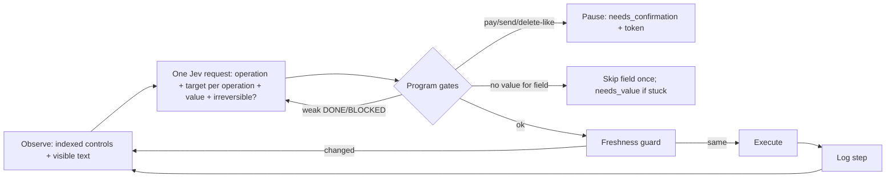

# Hosted execution

[简体中文](hosted-execution.zh-CN.md)

Jev Filter can execute, not only filter. Three commands run a program-owned loop in which Jev
chooses among options the program enumerated, the program acts, and the program checks the
result:

| Command | Surface | What it does |
|---|---|---|
| `browse` | A web page (Chrome/Edge/Chromium over DevTools, or Camofox) | Works toward a natural-language goal: clicks, typing supplied values, dropdowns, scrolling |
| `desktop` | One Windows or macOS application | The same loop over accessibility controls, with an OCR fallback for drawn UI |
| `extract` | A web page | Structures the page into records (table rows, blocks, links) and selects the relevant ones |
| `survey` | Thousands of records | Typed questions per record, aggregated in code into distributions, crosstabs and examples |

Jev never produces text, selectors, coordinates, commands or scripts. Every executed target is a
node the program observed; its identity and state are re-checked immediately before input.

## How one step works



- **One request per step.** The operation question (`CLICK`, `TYPE_TEXT`, `SELECT`, `SCROLL_*`,
  `PRESS_ENTER`, `BACK`, `WAIT`, `DONE`, `BLOCKED`) and a target question for each operation are
  asked together; only the head matching the chosen operation can execute. This design comes
  from [browser-use/jev-ultrafast](https://github.com/browser-use/jev-ultrafast) (MIT).
- **Decisions are consumed once.** A stale decision is discarded before any mutation; a retry
  cannot double-click. Executions are logged before the next observation.
- **DONE is not proof.** `--verify-text`, `--verify-url` and `--verify-question` run on a fresh
  observation after the loop stops; failure yields `unverified`.
- **Budgets and stalls.** 60 steps and 120 decisions by default; three consecutive unchanged
  observations (other than `WAIT`) end the run as `blocked`.

## Browser: `browse`

```sh
jev-filter browse --url https://shop.example/ \
  --goal 'Search for red shoes in the Shoes category, in stock only' \
  --value query='red shoes' \
  --verify-url 'results.*cat=shoes'
```

- **Transports.** The default launches a private headless Chrome, Edge or Chromium with a
  throw-away profile (set `JEV_BROWSER_EXECUTABLE` or `--browser-executable`). `--cdp-port N`
  attaches to a browser you started with `--remote-debugging-port=N`, including your logged-in
  profile. `--transport camofox --session S` drives a local [Camofox](https://github.com/redf0x1/camofox-browser)
  server on `127.0.0.1:9377` (anti-detection Firefox). The DevTools client is standard-library
  only and accepts loopback `ws://` endpoints only.
- **What the page script observes.** Common HTML and ARIA controls, including open shadow roots
  and same-origin frames; native `<select>` options become individual choices; controls covered
  by an overlay are excluded; visible text is joined by table row; controls inside a row carry
  that row's text. Password, hidden and file inputs are never observed. Fields with
  `autocomplete` values such as `cc-*`, `one-time-code` or `*-password` are shown only as
  `[filled]`.
- **Values.** Jev cannot write text. Supply named values with `--value key=value` or
  `--values file.json` (`{"card": {"value": "…", "sensitive": true}}` keeps a value out of the
  model state and the archive). Jev chooses which named value fits the chosen field. With no
  fitting value the field is skipped once; if the run then cannot finish it ends as
  `needs_value` and lists the fields. Optionally, `--text-model` lets an OpenAI-compatible model
  (`JEV_TEXT_BASE_URL`, `JEV_TEXT_API_KEY`, `JEV_TEXT_MODEL`) write a value that the goal implies;
  it must return exactly `{"text": …}` and never invents personal data.
- **Origins.** Navigation is limited to the start URL's origin plus `--allow-origin`. Leaving it
  ends the run as `origin_blocked`. `--any-origin` removes the restriction.
- **Dialogs.** JavaScript dialogs are dismissed and recorded; `--accept-dialogs` accepts only
  `alert` and `beforeunload`, never `confirm`.

### Irreversible actions pause

Two independent signals mark an action irreversible: a keyword rule on commit-style controls
(buttons, links, menu items; for example *pay*, *place order*, *send*, *delete* and their Chinese equivalents), and
Jev's probability for the question "would the best next operation commit an effect the user
cannot undo". Toggles, tabs and options are never gated. A gated action ends the run with the
pending action and a `confirm_token`:

```sh
jev-filter browse --url https://shop.example/ --goal 'Buy the cheapest red shoes in size 42' \
  --value query='red shoes' --keep-open
# → {"status":"needs_confirmation","pending":{"label":"Place order"},
#    "confirm_token":"f25e…:e2","session":{"cdp_port":58111,"target_id":"0A92…"}}

# After the user approves:
jev-filter browse --cdp-port 58111 --target-id 0A92… --confirm f25e…:e2 \
  --goal 'Buy the cheapest red shoes in size 42' --verify-text 'order has been placed' --close-browser
```

The token binds the page fingerprint and the action; if anything changed, the confirmation is
rejected as stale. By default the resumed run executes only the confirmed action, verifies and
stops (`--continue-after-confirm` keeps going). `--allow-irreversible` disables the gate for a run.

The program appends one fixed sentence to the goal: irreversible steps are gated by the program,
so keep advancing. Without it, goals ending in *buy* or *place the order* made Jev choose
`BLOCKED` early (probability 0.46–0.60 in probes; 0.09–0.13 with the sentence).

## Page data: `extract`

```sh
jev-filter extract --url 'https://shop.example/results?q=red' \
  --task 'In-stock shoes under $70' --analysis analysis.json
```

Tables become header-labelled rows (`Product: Red Runner | Price: $59 | …`); headings, list items,
paragraphs and links become records with their nearest section. The records then go through the
same contract as `query`, so `selected_ids`, `review_ids`, context admission and output
projection behave identically. Nothing is clicked.

## Desktop: `desktop`

```sh
pip install 'jev-filter[desktop]'          # Windows: UI Automation + OCR; macOS: pyobjc
jev-filter desktop --list                  # candidate windows
jev-filter desktop --window '^Invoice Tool$' \
  --goal 'Set the customer name to Ada Lovelace, choose the Pro plan and save' \
  --value name='Ada Lovelace' --verify-text 'saved Ada Lovelace'
```

- **Windows** uses UI Automation through the `uiautomation` package. Controls are executed
  through their patterns first (Invoke, Toggle, SelectionItem, Value, ExpandCollapse), which need
  no pointer movement or focus. A pointer click is the fallback and happens only after
  hit-testing that the point still belongs to the target. The observation covers the target
  window plus the same process's popups and dialogs (for example a combo box's drop-down list).
  Title-bar buttons are excluded, and password fields are never observed.
- **macOS** uses the Accessibility API through pyobjc (`AXPress`, `AXPick`, `AXValue`). Grant the
  terminal or app that runs jev-filter access in System Settings → Privacy & Security →
  Accessibility; without it the run stops with `accessibility_permission_required`.
- **OCR fallback.** When accessibility exposes fewer than two controls (canvas, games,
  custom-drawn UI), text lines from `Windows.Media.Ocr` or macOS Vision become click targets. A
  pixel hash of the line's rectangle must be unchanged at click time. `--ocr on|off` forces it.
- **Launching.** `--launch 'command'` starts the application and closes it after the run unless
  `--keep-open`.

## Many records: `survey`

```sh
jev-filter survey --input tickets.jsonl --spec survey.json --format md
```

```json
{
  "task": "What do customers contact support about, how do they feel, and who may churn?",
  "keep": ["product"],
  "screen": {"instructions": "The record is a genuine support request (not spam)."},
  "questions": {
    "topic": {"type": "choice", "instructions": "Main topic?",
              "criteria": {"billing": "…", "bug": "…", "shipping": "…", "other": "…"}},
    "sentiment": {"type": "score", "instructions": "How does the customer feel?",
                  "criteria": ["Angry", "Neutral", "Positive"]},
    "churn": {"type": "noul", "instructions": "Threatens to cancel or switch."}
  },
  "group_by": ["topic", "product"],
  "confidence_floor": 0.6
}
```

- Inputs: JSONL, JSON arrays, CSV and directories (`.txt`/`.md` files become records); `-` reads
  stdin. Long texts are cut and flagged. The record cap (200,000 by default) is reported, never
  silent.
- `screen` asks one noul per record first; only records that pass get the full question set.
- Questions are packed many records per request and run with up to 30 requests in flight,
  reusing the planner behind `query`.
- The report is computed by code: counts and shares per option, score means and levels, yes
  shares, crosstabs by question or kept field, the most confident examples per group (bounded by
  `--budget-chars`), uncertain and failed record IDs, token usage and estimated input cost. Per-record
  answers go to the private archive.
- `--propose-categories QUESTION` lets the text model name categories from a fixed-seed sample;
  Jev then classifies every record into them plus `other`. Jev itself never writes summaries: use
  your agent's LLM to narrate the report.

## Statuses and exit codes

| Status | Meaning | Exit |
|---|---|---|
| `done` | Goal reported done and every verifier passed | 0 |
| `unverified` | DONE, but a verifier failed | 2 |
| `needs_confirmation` | Next action is irreversible; `pending` and `confirm_token` included | 2 |
| `needs_value` | A field needs a value that was not supplied | 2 |
| `blocked` | No available operation can progress, or no progress for three steps | 2 |
| `origin_blocked` | Navigation left the allowed origins | 2 |
| `budget_exhausted` | Step or decision budget reached | 2 |
| `error` | Transport or provider failure; nothing was retried blindly | 2 |

stdout carries a compact packet (status, trace of operations and labels, usage, verification). The
archive file named in `archive` holds the full history, per-step decision distributions and
latencies.

## Limits

- A valid choice can still be wrong. Verify outcomes independently for anything that matters.
- Canvas, closed shadow roots, cross-origin frames, drag and drop, file uploads, CAPTCHAs and
  sign-in forms are not handled. Password fields are never filled: use a pre-authenticated
  profile (`--cdp-port`, Camofox) instead.
- Camofox clicks by CSS selector in the top document, so controls inside frames are not offered
  there. Each Camofox click also waits about 1.7 s inside Camofox.
- Desktop coverage depends on what an application exposes to accessibility APIs. Electron and
  Chromium windows are large (hundreds of controls, about 1.5 s per observation on Windows).
- macOS support is tested with a fake accessibility tree offline and on macOS runners when
  Accessibility can be granted; it was not exercised on a physical Mac during development.
- Page text, control labels and record text are sent to TypeSafe for inference.
