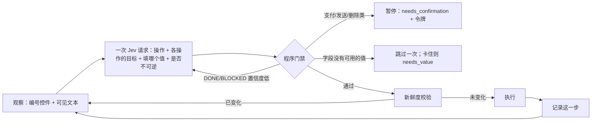

# 托管执行

[English](hosted-execution.md)

Jev Filter 不只过滤，也能执行。下面的命令都跑在程序自己掌控的循环里：程序枚举候选，Jev 在候选里选择，程序执行并校验结果。

| 命令 | 对象 | 作用 |
|---|---|---|
| `browse` | 网页（通过 DevTools 驱动 Chrome/Edge/Chromium，或 Camofox） | 朝一个自然语言目标推进：点击、填入调用方提供的值、选下拉、滚动 |
| `desktop` | 一个 Windows 或 macOS 应用 | 同样的循环，作用在无障碍控件上；自绘界面用 OCR 兜底 |
| `extract` | 网页 | 把页面结构化成记录（表格行、文本块、链接），再选出相关的 |
| `survey` | 成千上万条记录 | 对每条记录做类型化判断，由代码汇总成分布、交叉表和代表样本 |

Jev 从不产出文字、选择器、坐标、命令或脚本。每个被执行的目标都是程序观察到的节点，执行前会重新核对它的身份和状态。

## 一步是怎么走的



- **每步一次请求。** 操作题（`CLICK`、`TYPE_TEXT`、`SELECT`、`SCROLL_*`、`PRESS_ENTER`、`BACK`、`WAIT`、`DONE`、`BLOCKED`）和每种操作的目标题一起问，只有和选中操作对应的那道目标题会被执行。这个设计来自 [browser-use/jev-ultrafast](https://github.com/browser-use/jev-ultrafast)（MIT）。
- **每个决策只消费一次。** 过期的决策在任何改动之前就被丢弃，重试不会重复点击。执行记录写在下一次观察之前。
- **DONE 不是证据。** `--verify-text`、`--verify-url`、`--verify-question` 在循环结束后的新观察上运行，不通过则为 `unverified`。
- **预算、卡死与打转。** 默认最多 60 步、120 次决策；连续三次观察没有变化（`WAIT` 除外），或同一页面状态第三次出现，都以 `blocked` 结束。
- **交还是正常结果。** 验证码（reCAPTCHA、hCaptcha、Cloudflare）按确定性规则检测，从不尝试求解，运行以 `blocked` 结束，原因为 `challenge`。页面上有密码框时选了 `BLOCKED`，原因为 `login_required`。`--dry-run` 只观察并决策一步，不执行。

## 浏览器：`browse`

```sh
jev-filter browse --url https://shop.example/ \
  --goal 'Search for red shoes in the Shoes category, in stock only' \
  --value query='red shoes' \
  --verify-url 'results.*cat=shoes'
```

- **传输方式。** 默认启动一个私有的无头 Chrome、Edge 或 Chromium，配置目录用完即删（用 `JEV_BROWSER_EXECUTABLE` 或 `--browser-executable` 指定）。`--cdp-port N` 挂接到你用 `--remote-debugging-port=N` 启动的浏览器，可以是已登录的个人配置。`--transport camofox --session S` 驱动本机 `127.0.0.1:9377` 上的 [Camofox](https://github.com/redf0x1/camofox-browser)（反检测 Firefox）。DevTools 客户端只用标准库，只接受回环地址的 `ws://`。
- **页面脚本观察什么。** 常见的 HTML 和 ARIA 控件，包括开放式 shadow root 和同源 iframe；原生 `<select>` 的每个选项单独成为候选；被遮挡的控件不提供；可见文本按表格行合并；行内控件带上所在行的文本。密码、隐藏、文件类输入框从不观察。`autocomplete` 为 `cc-*`、`one-time-code`、`*-password` 的字段只显示 `[filled]`。
- **值。** Jev 不会写文字。用 `--value key=value` 或 `--values file.json` 提供具名值；`{"card": {"value": "…", "sensitive": true}}` 让这个值既不进模型状态也不进归档。Jev 负责判断哪个具名值属于选中的字段。没有合适的值时先跳过该字段一次；如果运行因此无法完成，以 `needs_value` 结束并列出字段。可选的 `--text-model` 让一个 OpenAI 兼容模型（`JEV_TEXT_BASE_URL`、`JEV_TEXT_API_KEY`、`JEV_TEXT_MODEL`）写出目标里隐含的值，它只能返回 `{"text": …}`，不会编造个人信息。
- **来源限制。** 导航限制在起始 URL 的来源和 `--allow-origin` 列出的来源内，越界以 `origin_blocked` 结束；`--any-origin` 取消限制。
- **弹窗。** JavaScript 弹窗默认取消并记录；`--accept-dialogs` 只接受 `alert` 和 `beforeunload`，从不接受 `confirm`。

### 不可逆动作会暂停

两个独立信号判定不可逆：一是作用在提交型控件（按钮、链接、菜单项）上的关键词规则，例如"支付""下单""发送""删除"及对应英文；二是 Jev 对"下一步是否会产生用户无法撤销的效果"的概率。勾选框、选项卡、选项永远不拦。被拦下时，运行以待执行动作和 `confirm_token` 结束：

```sh
jev-filter browse --url https://shop.example/ --goal 'Buy the cheapest red shoes in size 42' \
  --value query='red shoes' --keep-open
# → {"status":"needs_confirmation","pending":{"label":"Place order"},
#    "confirm_token":"f25e…:e2","session":{"cdp_port":58111,"target_id":"0A92…"}}

# 用户同意后：
jev-filter browse --cdp-port 58111 --target-id 0A92… --confirm f25e…:e2 \
  --goal 'Buy the cheapest red shoes in size 42' --verify-text 'order has been placed' --close-browser
```

令牌绑定了页面指纹和动作，页面有任何变化都会以过期拒绝。默认续跑只执行被确认的那一个动作，校验后结束（`--continue-after-confirm` 可继续）。`--allow-irreversible` 对单次运行关闭门禁。

程序会在目标后追加一句固定说明：不可逆步骤由程序把关，照常推进。没有这句时，以"购买""下单"结尾的目标会让 Jev 过早选 `BLOCKED`（探针测得概率 0.46–0.60，加上后 0.09–0.13）。

## 页面数据：`extract`

```sh
jev-filter extract --url 'https://shop.example/results?q=red' \
  --task 'In-stock shoes under $70' --analysis analysis.json
```

表格变成带表头的行（`Product: Red Runner | Price: $59 | …`），标题、列表项、段落、链接变成带所属章节的记录，之后走和 `query` 完全相同的契约：`selected_ids`、`review_ids`、上下文准入、输出投影都一样。不会点击任何东西。

## 桌面：`desktop`

```sh
pip install 'jev-filter[desktop] @ git+https://github.com/apixly-ai/jev-filter.git@v0.3.0'   # Windows：UI Automation + OCR；macOS：pyobjc
jev-filter desktop --list                  # 列出候选窗口
jev-filter desktop --window '^Invoice Tool$' \
  --goal 'Set the customer name to Ada Lovelace, choose the Pro plan and save' \
  --value name='Ada Lovelace' --verify-text 'saved Ada Lovelace'
```

- **Windows** 通过 `uiautomation` 包使用 UI Automation。优先调用控件自身的模式（Invoke、Toggle、SelectionItem、Value、ExpandCollapse），不需要移动鼠标或抢焦点；鼠标点击只是兜底，点击前会命中测试该坐标仍属于目标控件。观察范围是目标窗口加上同一进程的弹出层和对话框（例如下拉框展开的列表）。标题栏按钮不提供，密码框从不观察。
- **macOS** 通过 pyobjc 使用 Accessibility API（`AXPress`、`AXPick`、`AXValue`）。需要在"系统设置 → 隐私与安全性 → 辅助功能"里授权运行 jev-filter 的终端或应用，否则以 `accessibility_permission_required` 停止。
- **OCR 兜底。** 无障碍接口暴露的控件少于两个时（画布、游戏、自绘界面），用 `Windows.Media.Ocr` 或 macOS Vision 识别出的文本行作为点击目标，点击时该行区域的像素哈希必须未变。`--ocr on|off` 可强制开关。
- **启动应用。** `--launch '命令'` 启动目标应用，运行结束后关闭，除非加 `--keep-open`。
- **模态对话框。** 如果按钮的处理函数会弹出模态框，对它做 UI Automation 的 Invoke 会一直不返回，之后对该应用的所有 UIA 调用也会卡住（在 WinForms 的 MessageBox 上实测到）。所以主窗口里的按钮通过 `SendMessageTimeout` 发送 `BM_CLICK`，1 秒内返回，对话框仍可被观察；对话框里的按钮用独立线程做 Invoke。

### 桌面安全门禁

以下确定性检查都在任何 Jev 信号之前执行：

- **拒绝敏感目标**：终端和控制台窗口（在里面输入就是执行命令）、密码管理器、凭据与提权弹窗、系统设置、注册表和进程管理器。`--allow-sensitive-app` 可对单次运行放行。
- **随时中止**：创建 `JEV_STOP_FILE` 指定的文件（默认 `~/.jev-filter/STOP`），或把鼠标停在屏幕左上角，下一次输入会被拒绝，运行以 `error` 结束。
- **环境检查**：会话已锁定、处于安全桌面，或（Windows）目标以管理员运行而 jev-filter 没有，都会直接拒绝，而不是让输入被静默丢弃。
- `jev-filter doctor` 报告浏览器、桌面后端、OCR、锁屏与提权状态；在 macOS 上还报告辅助功能与屏幕录制是否已授权。

## 大量记录：`survey`

```sh
jev-filter survey --input tickets.jsonl --spec survey.json --format md
```

```json
{
  "task": "What do customers contact support about, how do they feel, and who may churn?",
  "keep": ["product"],
  "screen": {"instructions": "The record is a genuine support request (not spam)."},
  "questions": {
    "topic": {"type": "choice", "instructions": "Main topic?",
              "criteria": {"billing": "…", "bug": "…", "shipping": "…", "other": "…"}},
    "sentiment": {"type": "score", "instructions": "How does the customer feel?",
                  "criteria": ["Angry", "Neutral", "Positive"]},
    "churn": {"type": "noul", "instructions": "Threatens to cancel or switch."}
  },
  "group_by": ["topic", "product"],
  "confidence_floor": 0.6
}
```

- 输入支持 JSONL、JSON 数组、CSV 和目录（`.txt`/`.md` 文件各算一条记录），`-` 表示标准输入。过长的文本会截断并标记。记录上限（默认 20 万）触发时会在结果里说明，不会静默截断。
- `screen` 先对每条记录问一道是非题，只有通过的记录才问完整题目。
- 题目按多条记录打包成一个请求，最多 30 个请求并发，复用 `query` 背后的规划器。
- 报告全部由代码计算：各选项计数与占比、分数均值与分档、是非题的"是"占比、按题目或保留字段的交叉表、每组最有把握的样本（受 `--budget-chars` 限制）、不确定和失败的记录 ID、token 用量与估算输入成本。逐条答案写入私有归档。
- **预算。** 运行前先规划并估算请求数和输入 token（UTF-8 字节数除以 3，偏上限）。超过 `--max-usd`（默认 5）或 `--max-requests`（默认 1 万）会拒绝执行；`--dry-run` 只打印估算，不推理。
- **校准。** `--labels labels.jsonl`（`{"id": …, "topic": "billing", "churn": true}`）会给出每题准确率、按置信度分段的准确率，以及样本不少于 20 条时能达到 95% 准确率的最低置信度门槛。没有标注时报告写明 `"calibrated": false`：阈值取决于你的数据和模型版本。
- `--propose-categories QUESTION` 让文字模型在固定种子的样本上起类别名，然后由 Jev 把所有记录分到这些类别和 `other` 里。Jev 本身从不写总结，叙述交给你的 agent 的大模型基于报告完成。

## 状态与退出码

| 状态 | 含义 | 退出码 |
|---|---|---|
| `done` | 目标完成且所有校验通过 | 0 |
| `unverified` | 报告完成但校验未通过 | 2 |
| `needs_confirmation` | 下一步不可逆，附 `pending` 和 `confirm_token` | 2 |
| `needs_value` | 某字段需要调用方未提供的值 | 2 |
| `blocked` | 没有可推进的操作；`reason` 为 `challenge`、`login_required`、`model_blocked`、`no_progress` 或 `repeating` | 2 |
| `dry_run` | `--dry-run`：决定的动作在 `pending` 里，没有执行 | 2 |
| `origin_blocked` | 导航离开了允许的来源 | 2 |
| `budget_exhausted` | 步数或决策预算用尽 | 2 |
| `error` | 传输或服务端失败，没有盲目重试 | 2 |

标准输出是紧凑结果（状态、操作与标签轨迹、用量、校验结果）。`archive` 指向的文件保存完整历史、每步决策的概率分布和延迟。

## 限制

- 合法的选择也可能是错的。重要结果请独立核对。托管执行适合作为步骤短、结果可观测的执行器；开放网络上的长任务应由你的规划 agent 拆解，再逐步调用 `browse`。
- 控件超过 250 个的页面在单步里会被截断（`omitted_actions`），请滚动或缩小目标。
- 不支持画布、封闭式 shadow root、跨域 iframe、拖放、文件上传、验证码和登录表单。密码框永不填写：请使用已登录的配置（`--cdp-port`、Camofox）。
- Camofox 在顶层文档里按 CSS 选择器点击，所以 iframe 内的控件在该传输下不提供；每次点击在 Camofox 内部还要等约 1.7 秒。
- 桌面覆盖面取决于应用向无障碍接口暴露了什么。Electron 和 Chromium 窗口只有开启渲染器无障碍（例如 `--force-renderer-accessibility`）时才暴露网页内容，此时控件很多（数百个，Windows 上每次观察约 1.5 秒）。
- macOS 支持在离线测试中用模拟的无障碍树验证，并在可授权辅助功能的 macOS runner 上运行；开发期间没有在实体 Mac 上跑过。
- 在真实网站上实测到的缺口（0.3.0，[审计](benchmarks.zh-CN.md#真实网站与应用2026-09-30)）：没有 ARIA 角色的可点元素、用 `opacity: 0` 藏起来的原生输入不会提供，这会影响自定义组件和很多中文站点。只观察视口，所以折叠线以下或滚动侧栏里的链接需要先滚动。在新标签页打开的链接不会跟随。标题被本地化的验证页（例如 Cloudflare 的"请稍候…"）或其他厂商的验证页会以 `model_blocked` 而不是 `challenge` 结束。链接非常密集的页面可能超过接口输入上限，以 `error` 结束。`--verify-question` 只看页面文字，看不到勾选、按下等状态。
- 在真实桌面应用上实测到的缺口：滚出可视区域的列表项不会提供，也没有滚动动作；Qt 菜单栏项需要 Expand 而不是 Invoke；未开启无障碍的 Qt 程序会退回 OCR，可能把整条菜单栏合成一个目标；Chromium 和 Electron 窗口除非用 `--force-renderer-accessibility` 启动，否则网页内容不可见。
- 页面文本、控件标签和记录文本会发送给 TypeSafe 用于推理。
