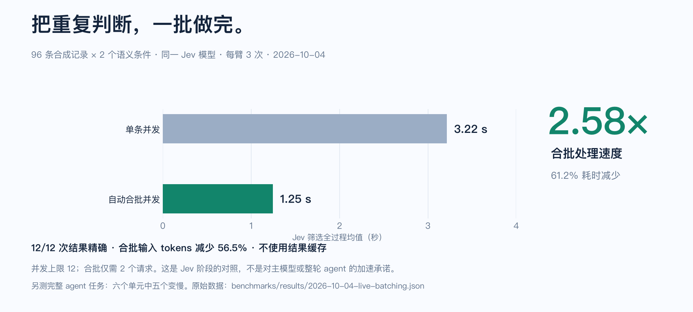

# 把关键信号交给 AI。

**返回工具上下文减少 91.6–97.2%。** 2026-10-04 付费 A/B：24 次真实 agent 运行、三个合成场景、两个主模型、每臂重复两次。把相关证据交给 AI，完整原文仍可按 ID 回查。

<a class="primary" href="getting-started.zh-CN.md">快速开始 →</a><a href="agent-quickstart.zh-CN.md">接入你的 AI</a><a href="benchmarks.zh-CN.md">核对实测证据</a>

## 96 条记录，同样精确的选中结果，1.31 秒。

**更快的语义筛选，用相同答案核验。** 最新付费同输出测试按两个语义条件筛选 96 条合成记录，全部 **9/9** 次都精确返回同样的 48 个匹配 ID。

| 实测路径 | 筛选耗时中位 | 精确完整结果 |
|---|---:|---:|
| **Jev `jev-1.13.0` · 自动合批 API** | **1.313 秒** | **3/3** |
| Luna `gpt-5.6-luna` · 已登录 Codex CLI | 13.421 秒 | 3/3 |
| Astra `gpt-6-astra` · 已登录 Codex CLI | 14.543 秒 | 3/3 |

这里对比执行路径：CLI 包含启动与主模型回合，模型原生延迟未分离，Jev 后面没有主模型续跑；主模型路径均为 medium 推理、不使用工具。每条路径三次是 smoke 样本，不是整轮 agent 提速或跨任务保证。[逐次数据](../benchmarks/results/2026-10-04-live-selection-speed.json) · [方法与复现](benchmarks.zh-CN.md#同输出筛选实测执行路径的速度)。

**合批处理重复判断。** 另一组 Jev 合批测试从 **96 个请求变成 2 个**，输入 tokens **减少 56.5%**，筛选速度为单条并发 Jev 调用的 **2.58 倍**（**3.215 → 1.246 秒**，耗时**减少 61.2%**）；全部 **12/12** 次结果精确，不依赖结果缓存。[合批阶段证据](../benchmarks/results/2026-10-04-live-batching.json)。

## 用更少噪声，支撑更多推理

**返回工具上下文减少 91.6–97.2%**。2026-10-04 实测 **24 次真实 agent 运行**：三个合成场景、两个主模型、每个实验臂重复两次。过滤后的 agent **12/12** 次完整完成任务，原文臂 **11/12**；全部 **24/24** 次返回正确 ID 集。

| 注意力留给难题 | 原文与判断随时可查 | 接入链路真实跑过 |
|---|---|---|
| 在一次程序操作内采集与判断，主模型接收相关证据及待复核 ID。 | 按来源 ID 保留完整原文、类型化判断与收据；来源新鲜度和终态独立验证。 | Python CLI、全新已发布 npm JS/原生包、官方 MCP、本地提取与 survey 的 **13/13 项付费 E2E 通过**。 |

**找回更多相关代码。** 可选召回结合原生筛选，正确匹配 **10/12**，精确候选为 **4/12**，误报为零。**查对真正要查的变更。** 有界 diff 筛查在两次重复中都选对四个目标变更，相比保留全部文件，返回上下文**减少 23.9%**。[真实调用数据与增加的工作](benchmarks.zh-CN.md)。

同一核心接入 **CLI、Python、JavaScript / TypeScript 与只读 MCP**，并提供可移植的 agent skill。自动合批、最多 30 个并发请求、不缓存推理结果，把重复判断留在程序里。[接入你的 AI](agent-quickstart.zh-CN.md#javascript-与-mcp)。

## 展示收益，也保留代价

**整段任务最强的实测结果是上下文缩减。** 六个单元中五个慢了 **0.1–18.4%**；冷输入 API 等价费用从**下降 23.2% 到增加 1.1%**。Codex 订阅实际账单未知。小型合成样本不保证你的任务更快或更省。

**浏览器的已验证进展：** 补充观察到的滚动容器证据后，嵌套滚动夹具在同一严格 **0.55 / 0.10** 策略下，完成 **0/3 → 3/3**。六次普通目标运行仍需复核；模型返回 `DONE`，还必须通过独立终态检查。[当前浏览器证据、失败变体与接管研究](benchmarks.zh-CN.md)。

[完整测试](benchmarks.zh-CN.md) · [安装并运行](getting-started.zh-CN.md) · [合成流程录制](showcase.zh-CN.md)

## 从实际任务开始

| 你想完成什么 | 下一步 |
|---|---|
| 安装并看到第一个选中结果 | [快速开始](getting-started.zh-CN.md) |
| 让 coding agent 使用 Jev Filter | [五分钟接入](agent-quickstart.zh-CN.md) |
| 采集工具输出、定位代码或排查日志 | [可复制的任务配方](recipes.zh-CN.md) |
| 使用浏览器、桌面或调研托管执行 | [托管执行](hosted-execution.zh-CN.md) · [录制回放](showcase.zh-CN.md) |
| 定义上下文、判断与复核策略 | [上下文契约](context-contract.zh-CN.md) |
| 在现有程序里嵌入推理 | [完整接入指南](agents.zh-CN.md) |
| 接入 JavaScript/MCP 或评测已保存判断 | [适配层与评测](integrations.zh-CN.md) |
| 核对质量、耗时、用量与费用 | [测试报告与原始数据](benchmarks.zh-CN.md) |

## 参考与项目

[CLI 参考](cli.zh-CN.md) · [架构](architecture.zh-CN.md) · [本地用量看板](statistics.zh-CN.md) · [发行包](distribution.zh-CN.md) · [开发与发布](development.zh-CN.md) · [首页设计](readme-design.zh-CN.md)

推理输入会发送到 TypeSafe。`exec` 执行你的可信命令；托管执行只允许程序枚举的动作。身份、授权、新鲜度与结果验证仍由现有流程负责。[信任边界](architecture.zh-CN.md)。

Jev Filter 由 Apixly / JIA-ss 独立维护，采用 MIT 许可证。[GitHub 仓库](https://github.com/apixly-ai/jev-filter) · [English](index.md)
