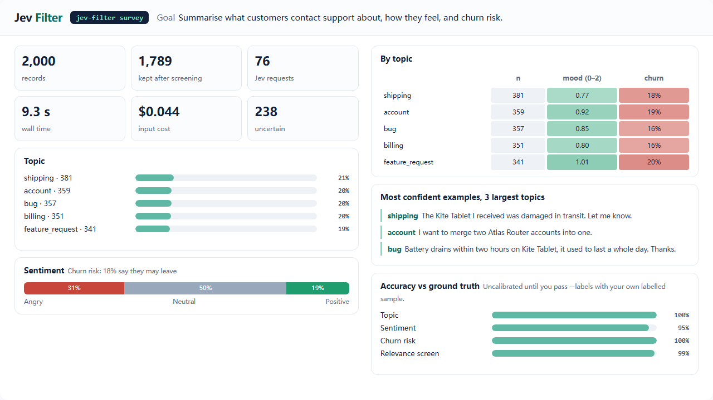

# Recorded runs

[简体中文](showcase.zh-CN.md)

These are recordings of real runs: live Jev (`jev-1.13.0`), the same executor `jev-filter browse`
and `desktop` use, on the synthetic fixtures in `benchmarks/sites`. The frames are the screenshots
taken after each observation, and the probabilities are the values Jev returned at that step.
Nothing is re-rendered or edited.

**[Open the interactive replay](assets/showcase/index.html)**. It has play and step controls,
browser, desktop and survey tabs, and English or Chinese labels.

## Browser: buy, pause, confirm

<video src="assets/showcase/browse.mp4" controls muted loop playsinline width="100%"></video>

Goal: *Buy the cheapest in-stock red shoes in size 42*, with one supplied value
(`query = red shoes`).

1. The cookie banner covers the page, so only its two buttons are offered. Jev rejects optional
   cookies.
2. Jev types the supplied value into the search box, ticks *In stock only* and searches.
3. On the results table it picks *Red Runner* (98%), the cheaper of the two in-stock rows.
4. It chooses size 42 in the native drop-down, adds the shoes to the cart and opens the cart.
5. *Place order* is a commit action. The keyword rule and Jev's own irreversible probability
   both flag it, so the run stops with `needs_confirmation` and a token bound to this page state and
   button. It goes stale as soon as the page changes. Nothing is clicked.
6. After approval, the program checks that the page fingerprint is unchanged and clicks. The
   verifier then finds "order has been placed" on a fresh observation.

| Jev requests | Input tokens | Input cost | Run time | Jev latency, median |
|---:|---:|---:|---:|---:|
| 9 | 26,251 | $0.0011 | 4.5 s | 322 ms |

Run time counts from the loaded start page to the verified result and excludes browser start-up.

## Desktop: the same loop in a Windows app

<video src="assets/showcase/desktop.mp4" controls muted loop playsinline width="100%"></video>

A Windows Forms application with a text field, a drop-down, a checkbox, tabs and two buttons,
driven through UI Automation. Two goals are shown.

1. *Set the customer name to Ada Lovelace, choose the Pro plan, turn on the weekly report, and
   save the profile* takes five actions: type the supplied name, open the plan list, pick *Pro*,
   tick the checkbox and save. The verifier then finds "saved Ada Lovelace / Pro / weekly=True" in
   the window.
2. *Delete all records* stops before the first click. The keyword rule flags the button, and
   Jev's irreversible probability is 56%. The run returns `needs_confirmation`, and the records
   are not deleted.

The drop-down list is its own popup window, which the recording's window capture does not
include, so the replay highlights the combo box that owns the chosen option.

| Jev requests | Input tokens | Input cost | Run time, both goals | Jev latency, median |
|---:|---:|---:|---:|---:|
| 7 | 24,019 | $0.0010 | 6.9 s | 354 ms |

Run time excludes starting the application.

Runs are not identical. This scene was recorded four times on 2026-09-30. In one of them, Jev typed
the name again after saving, which reset the window's status line, and the run correctly ended
`unverified` instead of `done`. The replay shows a successful recording.

## Survey: 2,000 records, one command



The tickets come from `benchmarks/survey_data.py` (five topics, three tones, churn mentions, about
10% spam, English and Chinese). One `survey` run screened out spam, answered three typed questions
per record and aggregated the answers in code. The dashboard draws the report as returned.

| Records | Kept after screening | Jev requests | Input tokens | Input cost | Wall time |
|---:|---:|---:|---:|---:|---:|
| 2,000 | 1,789 | 76 | 1,041,281 | $0.044 | 9.3 s |

Against the generator's labels, topic was 100% correct, sentiment 95.2%, churn 100% and the spam
screen 98.7%. The screen dropped 27 genuine tickets along with 184 spam ones. The records are
template-generated and easy, so these numbers say nothing about your data. Measure your own with
`--labels`.

## How the recordings are made

```sh
python -m benchmarks.showcase.record --demo browse    # live, about $0.001
python -m benchmarks.showcase.record --demo desktop   # live, Windows, takes the foreground
python -m benchmarks.showcase.record --demo survey    # live, about $0.05
python -m benchmarks.showcase.render --media          # data.js, GIF, MP4, PNG (ffmpeg + Playwright)
```

- The recorder wraps the real surface and the real Jev client and only watches. After each
  observation it saves a screenshot. It keeps the distributions each Jev answer returned and the
  rectangle of every executed target. The request text is not kept.
- `render` builds `data.js` for the replay page. It then screenshots that page frame by frame,
  so the GIFs, videos and the page show the same thing.
- Values marked sensitive would appear as `[sensitive]`. The demos use none.

## What this does not show

These are short goals on fixtures built for the tests. They demonstrate the mechanics, the gates
and the costs, not success on arbitrary websites or applications. For measured behaviour on real
sites and the known gaps, see the [hosted execution guide](hosted-execution.md#limits) and the
[benchmarks](benchmarks.md).
