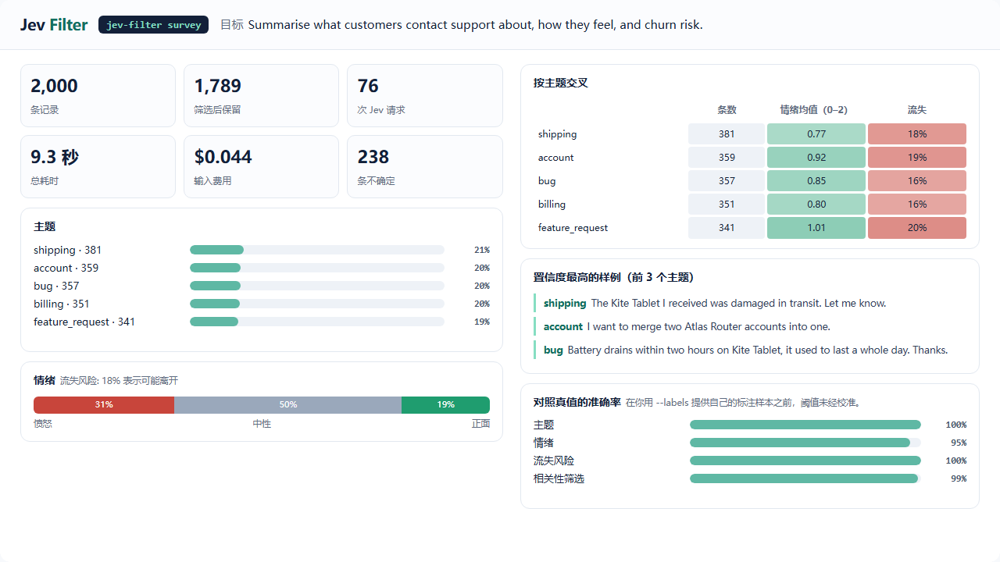

# 录制回放

[English](showcase.md)

这些是真实运行的录像：真实 Jev（`jev-1.13.0`），用的就是 `jev-filter browse` 和 `desktop` 背后的执行器，跑在 `benchmarks/sites` 的合成夹具上。画面是每次观察后截下的屏幕，概率是那一步 Jev 实际返回的值，没有重新生成或修改。

**[打开交互式回放](assets/showcase/index.html?lang=zh)**：可以播放、逐步前进后退，有浏览器、桌面、调研三个标签页，界面文字可切换中英文。

## 浏览器：下单、暂停、确认

<video src="assets/showcase/browse.zh-CN.mp4" controls muted loop playsinline width="100%"></video>

目标：*Buy the cheapest in-stock red shoes in size 42*（买最便宜的有货红鞋，42 码），只提供了一个值（`query = red shoes`）。

1. cookie 横幅挡住了页面，所以只提供了它的两个按钮。Jev 选择拒绝可选 cookie。
2. Jev 把提供的值填进搜索框，勾选 *In stock only*，然后搜索。
3. 在结果表里它选了 *Red Runner*（98%），是两行有货商品里更便宜的那个。
4. 在原生下拉框里选 42 码，加入购物车，再打开购物车。
5. *Place order* 是提交类动作。关键词规则和 Jev 自己给出的不可逆概率都标记了它，所以运行以 `needs_confirmation` 结束，并返回一个绑定当前页面状态和按钮的令牌，页面一变就失效。什么都没有点。
6. 确认之后，程序先核对页面指纹没有变化，再点击。随后校验器在新的观察里找到了 "order has been placed"。

| Jev 请求 | 输入 token | 输入费用 | 运行时间 | Jev 延迟中位数 |
|---:|---:|---:|---:|---:|
| 9 | 26,251 | $0.0011 | 4.5 s | 322 ms |

运行时间从起始页加载完成算到结果校验通过，不含浏览器启动。

## 桌面：在 Windows 应用里跑同样的循环

<video src="assets/showcase/desktop.zh-CN.mp4" controls muted loop playsinline width="100%"></video>

一个 Windows Forms 应用，有文本框、下拉框、复选框、选项卡和两个按钮，通过 UI Automation 操作。演示了两个目标：

1. *Set the customer name to Ada Lovelace, choose the Pro plan, turn on the weekly report, and save the profile*（填姓名、选 Pro 套餐、打开周报、保存）用了五个动作：填入提供的姓名，展开套餐列表，选 *Pro*，勾选复选框，保存。随后校验器在窗口里找到了 "saved Ada Lovelace / Pro / weekly=True"。
2. *Delete all records*（删除全部记录）在第一次点击前就停下。关键词规则标记了这个按钮，Jev 给出的不可逆概率是 56%。运行返回 `needs_confirmation`，记录没有被删除。

下拉列表是一个独立的弹出窗口，录制时的窗口截图不包含它，所以回放里高亮的是这个选项所属的下拉框。

| Jev 请求 | 输入 token | 输入费用 | 两个目标的运行时间 | Jev 延迟中位数 |
|---:|---:|---:|---:|---:|
| 7 | 24,019 | $0.0010 | 6.9 s | 354 ms |

运行时间不含启动应用。

每次运行并不完全相同。这一幕在 2026-09-30 录了四次，其中一次 Jev 在保存之后又把姓名填了一遍，窗口的状态行因此被重置，运行如实以 `unverified` 而不是 `done` 结束。回放展示的是一次成功的录制。

## 调研：2000 条记录，一条命令



工单由 `benchmarks/survey_data.py` 生成（五类主题、三种语气、流失意图、约 10% 垃圾内容，中英混合）。一次 `survey` 运行先筛掉垃圾内容，再对每条记录回答三个类型化问题，由代码汇总。看板按返回的报告原样绘制。

| 记录 | 筛选后保留 | Jev 请求 | 输入 token | 输入费用 | 总耗时 |
|---:|---:|---:|---:|---:|---:|
| 2,000 | 1,789 | 76 | 1,041,281 | $0.044 | 9.3 s |

对照生成器的标签：主题 100% 正确，情绪 95.2%，流失 100%，垃圾筛选 98.7%。筛选在去掉 184 条垃圾的同时，也误去了 27 条真实工单。这些记录由模板生成、很容易判断，所以这些数字不能代表你的数据，请用 `--labels` 在自己的数据上测。

## 录制方法

```sh
python -m benchmarks.showcase.record --demo browse    # 真实调用，约 $0.001
python -m benchmarks.showcase.record --demo desktop   # 真实调用，Windows，会占用前台
python -m benchmarks.showcase.record --demo survey    # 真实调用，约 $0.05
python -m benchmarks.showcase.render --media          # 生成 data.js、GIF、MP4、PNG（需要 ffmpeg 和 Playwright）
```

- 录制器包在真实的操作面和真实的 Jev 客户端外面，只看不改。每次观察后保存一张截图，记录每次 Jev 回答里的概率分布，以及每个被执行目标的位置。请求正文不保存。
- `render` 为回放页生成 `data.js`，再逐帧截取同一个页面，所以 GIF、视频和网页显示的是同一套内容。
- 标记为敏感的值会显示成 `[sensitive]`；这几个演示没有用到。

## 它不能说明什么

这些是在专门为测试搭建的夹具上完成的短目标。它们展示的是机制、门禁和成本，不代表在任意网站或应用上都能成功。真实网站上的实测表现和已知缺口，见[托管执行说明](hosted-execution.zh-CN.md#限制)和[测试与数据](benchmarks.zh-CN.md)。
